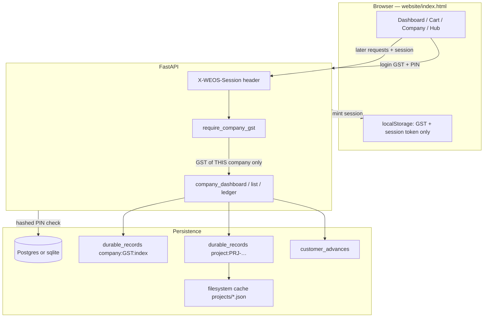

# WEOS Blueprint — Window Engineering Operating System

**Product:** WEOS v2.0.0 — Design • Calculate • Manufacture • Quote  
**This file:** one-page architecture of what the running code actually does (16 Aug 2026, commit `9cd22e2` on `main`).  
**Not a promise sheet.** Numbers below are **code limits** and **tested behaviour**, not marketing.

---

## 1. What this software is

WEOS is a **factory ERP + quote engine** for aluminium / uPVC windows, doors, railings, ventilators, showers, and package (outside) quotes.

It is **not** only a CAD drawer. The product is:

1. A **company workspace** (GSTIN + 4-digit PIN).
2. **Projects / quotes** with versions, PDF, QR scan.
3. **Money:** taxable / GST / grand, advances, balance, FY turnover.
4. **Manufacture:** BOM, glass, hardware, cut-list, weight, factory PDF.
5. **Learning / memory** (formulas, suggestions) — separate from live quotes.

**One company = one GSTIN.** Login identity is GSTIN **or** registered name **or** mobile, plus PIN. Same customer mobile inside one company is one client.

---

## 2. Technology (what is actually used)

| Layer | Technology | Where |
|---|---|---|
| Language | Python 3.11 (verified 3.11.9 on this machine) | whole backend |
| HTTP API | FastAPI + Uvicorn + Pydantic v2 | `WEOS/api/server.py` |
| UI | Single-page HTML/JS (no React build) | `WEOS/website/index.html` |
| Database | SQLAlchemy 2.x. **Postgres in production** (`DATABASE_URL`). **SQLite fallback** for local/dev | `WEOS/db/engine.py` |
| Documents | JSON payloads in `durable_records` + filesystem cache | `WEOS/db/durable_store.py` |
| Payments | SQL table `customer_advances` | `WEOS/db/models.py` |
| PDF | ReportLab, svglib, pypdf, Pillow, qrcode | factory `*_pdf.py` |
| Excel | openpyxl | import + export |
| CAD (optional) | ezdxf | DXF export, not default calculate |
| Auth | SHA-256 hashed 4-digit PIN + hashed session token (30 days, max 8 sessions) | `WEOS/factory/company_store.py` |
| Mail | SMTP PIN-reset (optional) | `WEOS/factory/company_mail.py` |
| Hosting target | Railway (`PORT`, `DATABASE_URL`) | `DEPLOY.md` |

Start:

```bash
pip install -r requirements.txt
python run_weos.py
# UI     http://127.0.0.1:8000/
# Docs   http://127.0.0.1:8000/docs
# Health http://127.0.0.1:8000/health
```

---

## 3. Folder blueprint

```
window cad model/
├── run_weos.py                 # local launcher
├── requirements.txt
├── WEOS/
│   ├── api/server.py           # FastAPI — all HTTP routes
│   ├── api/calculate.py        # product catalogue + calc response
│   ├── website/index.html      # ERP UI (dashboard, cart, company, scan…)
│   ├── db/
│   │   ├── engine.py           # Postgres / sqlite
│   │   ├── models.py           # SQL tables
│   │   ├── durable_store.py    # JSON/blob mirror (survives Railway wipe)
│   │   ├── quote_store.py      # older Quote table API
│   │   └── product_store.py
│   ├── factory/                # business engines (never duplicate in UI)
│   │   ├── company_store.py    # GST profile, PIN hash, sessions
│   │   ├── company_workspace.py# login / logout / hub KPIs
│   │   ├── company_index.py    # per-GST compact index (scale)
│   │   ├── company_dashboard.py# growth + follow-up
│   │   ├── company_quotes.py   # unused/duplicate quote tools
│   │   ├── fy.py               # Indian FY 1 Apr–31 Mar
│   │   ├── project_store.py    # PRJ save/load/version/archive
│   │   ├── project_import.py   # Excel/PDF pack import
│   │   ├── ledger_store.py     # advances, billed, balance
│   │   ├── package_quote.py    # outside / package quotes on a job
│   │   ├── quote_share.py      # public QR scan + 15d/7d windows
│   │   ├── pipeline.py         # calculate: geometry→glass→BOM→quote
│   │   ├── * _engine.py        # glass, hardware, weight, railing…
│   │   └── * _pdf.py           # customer / factory / ledger / slip
│   ├── products/<id>/          # product.json + rules (source of truth)
│   ├── templates/              # PDF layout JSON
│   ├── learning/ + memory/ + brain/ + agent/
│   └── _smoke_*.py             # real smoke tests
└── knowledge_base/             # learned formulas (review → approve)
```

---

## 4. Runtime architecture (how a click becomes data)



**Logout:** session hash removed on server + GST/session/cart keys wiped in the browser. Dashboard/projects/hub stay empty until login.

**Closed financial year:** rows stay in DB/index. Hot UI asks `fy=current` (this FY). User must click FY = All years (or a past FY) to fetch old jobs. They are not deleted.

---

## 5. How much it can handle (honest caps from code)

These are **hard or practical limits in today's code**, with Postgres assumed for the high end.

| Thing | Designed / coded cap | What that means |
|---|---|---|
| Companies | No create-limit. Index is **one JSON document per GST** | 10,000 companies is the **isolation design**. Login session lookup still walks company docs (`gst_for_session_token`) — that will get slow before Postgres row indexes are added |
| Quotes per company in the **hot index** | Last **20,000** project rows kept (`projects[-20000:]`) | 1,000 quotes/company is inside this. 20,001st oldest compact row can drop from the index (full JSON may still exist) |
| Customers in the **hot index** | Last **8,000** names | Fine for a factory; a huge dealer book needs a SQL customer table query |
| List page size | Default **50**, max **200** per request | UI never dumps 10,000 rows at once |
| Payments | SQL `SUM` / `IN (project_ids)` — not loaded into dashboard RAM | **10,000 payments** is a normal SQL sum if `project_id` + `company_gst` are set. Untagged old advances (no GST column) are the mix risk |
| Sessions per company | Last **8**, each **30 days** | Extra devices drop the oldest session |
| Package / outside quotes on **one job** | **40** quotes, **120** lines each | A 40-stage import pack is at the ceiling |
| Follow-up queue | **40** rows per bucket (high / medium / later) | Older than that still exist; they are not all drawn |
| Undo snapshots | last **20** line snapshots; revision log last **80** | Older undo is gone |
| PIN | exactly **4 digits**, SHA-256 with GST salt | **10,000 combinations** — not bank-grade. Rate-limit login is still missing |
| Public QR | approve **15 days**, reject **7 days** from create | After that, scanner buttons hide; office panel can still reject |

**Safe operating envelope (today, with Postgres):**

- **Hundreds to low thousands of companies**, each with **~1,000 live quotes** and **~10,000 advances**, if users stay on **current FY** lists and open old years / ledgers **on click**.
- **10,000 companies × 1,000 quotes** (10 million full JSON documents) is **not** proven. The index stops *cross-company file scans* on login, but first-time `rebuild_index` can still scan, and session resolve is O(companies).

**Local sqlite** is a **dev fallback**. Do not run a 10k-company factory on one sqlite file.

---

## 6. Data model (what is stored)

### 6.1 SQL tables (`WEOS/db/models.py`)

| Table | Role |
|---|---|
| `customers` | Mobile-keyed CRM row (quote_store path) |
| `projects` | Lightweight SQL project (legacy quote_store) |
| `quotes` + items/versions/bom/events | Older quote system (`/api/quotes`) |
| `durable_records` | **Source of truth for company JSON, project JSON, indexes, logos** |
| `customer_advances` | Payments: amount, mode, project_id, quote_id, **company_gst**, paid_at |
| `library_files` | Product library blobs |

Live ERP quotes are **`durable_records` kind=`project`** (full cart JSON), not only the `quotes` table.

### 6.2 Project document (JSON)

`projectId`, `quotationId`, `companyGst`, `customer`, `customerMobile`, `status`, `lines[]`, `packageQuotes[]`, `quoteDiscount`, `shareToken`, `followUps[]`, `lastFollowUpAt`, `version`, `createdAt`, `updatedAt`.

**Status that counts as an order / FY turnover:** `approved`, `confirmed`, `accepted`, `finalized`, `ordered`, `order`, `won`. Drafts do **not** count.

### 6.3 Company document (JSON)

GSTIN, name, address, phone, email, bank, terms, **loginPinHash** (never returned), **loginSessions[]** (hashes only), logo paths.

### 6.4 Company index (JSON, one per GST)

Compact rows only (no cart lines): id, customer, amounts, dates, `fy`, last follow-up. Used by dashboard and paginated lists.

---

## 7. Company login — every function

**File:** `WEOS/factory/company_store.py`

| Function | What it does |
|---|---|
| `normalise_gstin` | Uppercase GST, strip spaces |
| `hash_login_pin` | SHA-256 of `weos-login-pin\|GST\|PIN` — PIN never stored |
| `validate_login_pin` | Must be exactly 4 digits |
| `verify_login_pin` | Compare hash |
| `company_has_login_pin` | True if hash exists |
| `public_company_profile` | Strips PIN, hashes, sessions before API |
| `save_company_by_gst` / `load_company_by_gst` | Upsert/load one GST workspace |
| `mint_workspace_session` | Random token, store hash, 30 days, keep 8 |
| `gst_for_session_token` | Which GST owns this token (**walks all companies**) |
| `verify_workspace_session` | Hash + expiry check |
| `revoke_workspace_session` | Logout |
| `mint_pin_reset_token` / `consume_pin_reset_token` | Email reset, 1 hour |

**File:** `WEOS/factory/company_workspace.py`

| Function | What it does |
|---|---|
| `find_companies_for_login` | Match GST / name / mobile |
| `open_workspace` | Create or login; mint session; return KPIs |
| `require_company_gst` | **401 unless live session.** Query GST alone is not enough |
| `logout_workspace` | Revoke session + clear active GST |
| `request_pin_reset` / `confirm_pin_reset` | Generic ack; email if registered |
| `build_workspace_summary` | Current-FY KPIs; **lists empty unless `lists=True`** (lazy) |
| `validate_gstin_format` | 15-char shape check |
| `_migrate_legacy_into` | Attach unscoped rows only if this is the first GST |

**HTTP**

| Method | Path | Gate |
|---|---|---|
| POST | `/api/company/workspace/open` | PIN or session |
| POST | `/api/company/workspace/logout` | token |
| GET | `/api/company` | empty if logged out |
| GET | `/api/company/workspace` | session |
| GET/PUT | `/api/company` | save profile (PIN optional to set) |

UI: `isCompanyLoggedIn`, `wipeLoggedOutUi`, `setView` blocks dashboard/projects/cart/customers until login.

---

## 8. Dashboard + follow-up — every function

**File:** `WEOS/factory/company_dashboard.py`  
**HTTP:** `GET /api/dashboard` (session), `POST /api/projects/{id}/follow-up`

| Function | What it does |
|---|---|
| `_delta` / `_period` | This vs last: amount, %, growth / less / flat |
| `wa_link` / `tel_link` | `https://wa.me/91…` and `tel:+91…` |
| `company_dashboard` | Orders / collection / order-clear for **this month vs last month** and **this FY vs last FY**; follow-up queue; 8 recent jobs |
| `_followup_queue` | High ≥10 days, medium 5–9, later &lt;5, pending quotes only, current FY |
| `record_follow_up` | Append `{at, channel}` (whatsapp\|call), set `lastFollowUpAt`; must belong to logged-in GST |

UI: WhatsApp/Call click → POST follow-up → date shown next time.

---

## 9. Scale / FY / isolation — every function

**File:** `WEOS/factory/fy.py`

| Function | What it does |
|---|---|
| `fy_of` / `current_fy` | Indian FY label e.g. `2026-27` |
| `fy_bounds` | 1 Apr 00:00 UTC → next 1 Apr |
| `in_fy` | Date inside that FY? |

**File:** `WEOS/factory/company_index.py`

| Function | What it does |
|---|---|
| `compact_project` | Money + dates, no lines |
| `load_index` / `save_index` | `company:{GST}:index` in durable store |
| `upsert_project` / `remove_project` | On save / hard delete |
| `upsert_customer` | Name/phone into that GST only |
| `rebuild_index` | One-time scan **for this GST** (`use_index=False`) |
| `query_projects` | Filter fy/status/q, paginate, `hasMore` |
| `query_customers` | Paginated names for this GST |
| `all_project_rows` | Compact rows for dashboard math |

**File:** `WEOS/factory/project_store.py` (isolation bits)

| Function | What it does |
|---|---|
| `save_project` | Stamp `companyGst`, write file+DB, **upsert index** |
| `_belongs_to_company` | Row GST must match; unscoped excluded when `include_unscoped=False` |
| `list_projects` | If GST set → **index first**; fallback scan |
| `delete_project` | Hard delete also **drops index row** |
| `live_quote_money` | Taxable / GST / grand from live cart or package |

---

## 10. Money / ledger / import — every important function

**File:** `WEOS/factory/ledger_store.py`

| Function | What it does |
|---|---|
| `status_counts_toward_turnover` | Only approved-class statuses |
| `quote_money_parts` | Split ex-GST vs GST@18% |
| `add_advance` | SQL insert; stamps `company_gst` |
| `list_advances_for_projects` | **That project id only** — never another job |
| `list_advances_for_account` | Account names + pids; drop other `companyGst` |
| `sum_advances_for_company` | SQL SUM — dashboard does not load 10k rows |
| `build_ledger` | One customer, one GST: quotes + advances + balance |

**File:** `WEOS/factory/project_import.py`

| Function | What it does |
|---|---|
| `parse_excel_bytes` / `parse_pdf_bytes` | Multi-stage pack |
| `parse_upload` | Route by file type |
| `commit_imported_project` | Write project + optional advances (slips optional) |

**HTTP:** `POST /api/projects/import-pack`

**File:** `WEOS/factory/package_quote.py` — outside quotes on a Master Ledger job (`MAX_QUOTES=40`).

**File:** `WEOS/factory/quote_share.py` — public `/q/{token}`, scanner approve 15d / reject 7d.

---

## 11. Quote / manufacture pipeline

**File:** `WEOS/factory/pipeline.py` → `generate_job`

Order: load product JSON → geometry → glass → hardware → brush → track → materials → cut-list → weight → BOM → quotation.

Product rules live in `WEOS/products/<id>/`, **not** hardcoded millimetres in Python.

Special engines: `railing_engine`, `ventilator_engine`, `shower_engine`.

PDFs: customer (no BOM/purchase rates), factory, ledger, advance slip, elevation.

---

## 12. HTTP map (grouped)

**Open (no company session):** `/health`, `/api/version`, product catalogue, calculate/preview, public `/q/{ref}` scan, PIN-reset page, company logo for print, learning/memory/admin (not tenant-scoped).

**Needs live company session:** dashboard, project list/get, follow-up, customers list/quotes/ledger/advances, company workspace, company quotes delete.

**Still weak (see §14):** `GET/PUT /api/customers/{name}/profile` has **no** session in code today; several PDF/xlsx/ledger download routes; `PUT /api/projects/{id}` create path.

---

## 13. Dual verification — real tests (16 Aug 2026)

Environment: Python **3.11.9**, WEOS **2.0.0**, isolated temp sqlite (does not touch live `weos.db`).

Each script was run **twice in a row** (Pass A then Pass B).

| Script | What it proves | Pass A | Pass B | Match? |
|---|---|---|---|---|
| `WEOS/_smoke_scale_isolate.py` | Two GST companies, same customer name, lists/dashboard/follow-up **do not mix**; no session → 401; logout kills session; 12-day quote is high priority | **PASS** exit 0 `ALL OK` | **PASS** exit 0 `ALL OK` | Yes (temp DB path only differs) |
| `WEOS/_smoke_company_login.py` | PIN hash never returned; wrong PIN rejected; session reopen; logout revoke; email reset token; scanner 15d/7d | **PASS** `SMOKE_COMPANY_LOGIN_OK` | **PASS** | Yes (reset token differs) |
| `WEOS/_smoke_money_specs.py` | Quote money + specs PDF | **PASS** PDF **45485** bytes both times | **PASS** 45485 bytes | Yes |
| `WEOS/_smoke_company_ledger.py` | Company save + billed/balance | **FAIL** billed expected 150000 got **177000.0**; balance expected 85000 got **112000.0** | **FAIL same two numbers** | Yes — **reproducible bug**, not a flake |

**Isolate smoke assertions that passed both times:**

- Alpha list has only Alpha project  
- Beta list has only Beta project  
- Hot list is current FY `2026-27`  
- Dashboard scoped to Alpha  
- 12-day Alpha quote is high follow-up  
- Beta quote not on Alpha follow-up  
- Follow-up click recorded  
- Cross-company follow-up blocked  
- Session maps to Alpha GST  
- No session → 401  
- Logout kills session  

Other smokes in the repo (not dual-run this round): railing/PDF/ventilator/import/master-ledger/scan-pack. Run with `python WEOS/_smoke_<name>.py` from repo root.

---

## 14. Loss points — where sudhaar is required

Priority order (real, from code + dual tests):

1. **`_smoke_company_ledger.py` fails both runs** — billed 177000 vs expected 150000 (Δ 27000). Ledger totals and the smoke’s “one live quote” rule have drifted. **Fix the money rule or the test; do not ship FY reports until this is green twice.**

2. **Session lookup is O(number of companies)** — `gst_for_session_token` loops every company JSON. At 10k companies this is a login/API tax. Need `session_hash → gst` SQL index.

3. **Company index is one fat JSON blob** rewritten on every project save. At 20k compact rows this gets heavy. Need SQL table `(company_gst, project_id, fy, status, updated_at, totals…)` with indexes.

4. **`rebuild_index` can still glob/scan all project files** the first time an old GST has no index. Dangerous on a huge disk cache.

5. **Index truncates at 20,000 projects / 8,000 customers** — silent drop of oldest compact rows. Full JSON may remain but lists/dashboard can “lose” them.

6. **Customer profile GET/PUT is not session-gated** — another company (or logged-out client) can read/write by name. Quotes/ledger **are** gated; profile is not.

7. **Several money downloads** (`ledger.pdf`, slips, `customer.xlsx`, some pack files) may still be callable with only a project id. Lock them the same way as `GET /api/projects/{id}`.

8. **PIN is 4 digits + SHA-256** — fine against casual peeking, not against brute force. Add lockout (e.g. 5 tries / 15 min) and never log PIN. Do not put PIN in git.

9. **`CORS allow_origins=["*"]`** with credentials pattern — tighten to the real website origin for production.

10. **Duplicate `_migrate_legacy_into`** in `company_workspace.py` (dead first body). Python uses the **second** definition; the first is clutter and a future merge hazard. Delete the dead one.

11. **Advances without `company_gst` on old rows** — isolation falls back to `project_id`. Untagged “Any” advances on a **shared customer name** across two companies can still mix until backfilled.

12. **`list_payloads(kind="project")` still exists** for bootstrap — loading **all** projects into RAM on boot will not survive 10M docs. Boot should be GST-lazy.

13. **Learning / memory / admin APIs are global**, not per GST. Do not put one factory’s formulas into another’s workspace without a tenant key.

14. **sqlite in production** — Railway without `DATABASE_URL` will look saved then wipe on redeploy. Always set Postgres.

15. **No automated load test** at 10k companies. Dual smokes prove **isolation and login**, not 10-million-row throughput.

---

## 15. What it can do today (feature map)

| Area | Can do |
|---|---|
| Company | Unlimited create (practical DB size); GST/name/mobile + PIN; logout wipe; hashed PIN; email reset |
| Projects | Create, version, duplicate, archive, delete (type DELETE), undo/redo |
| Quotes | Cart products, package/outside quotes, discount, approve/reject, QR share |
| Money | FY turnover, advances, refunds, balance, advance slips (optional), GST 18% split |
| Dashboard | Month/FY growth %, collection, order clear, follow-up WhatsApp/Call with last date |
| Import | Multi-sheet Excel + PDF pack → stages + advances |
| PDF | Customer (no factory rates), factory, ledger, elevation, railing/ventilator/shower |
| Manufacture | 29mm sliding live; other products via catalogue + manual rate / special engines |
| Scan | Public latest quote; approve 15 days; reject 7 days |
| FY | Hot = current FY; old years fetch-on-demand |

---

## 16. How to re-run dual verification

From repo root (does not touch live company data):

```bash
python WEOS/_smoke_scale_isolate.py
python WEOS/_smoke_company_login.py
python WEOS/_smoke_money_specs.py
python WEOS/_smoke_company_ledger.py
# immediately run the same four again — Pass A and Pass B must match
```

**Pass rule:** same exit code and same FAIL numbers if any. A test that fails once and passes once is a flake; ledger currently **fails the same way twice** — that is a real defect.

---

## 17. Related docs

| File | Scope |
|---|---|
| `ARCHITECTURE.md` | Older V2 API/product-library overview |
| `DEPLOY.md` | Railway / `DATABASE_URL` |
| `WEOS/BLUEPRINT.md` | **This file** — company isolation, FY, capacity, tests |

---

*Generated from the repository on 16 Aug 2026. If the code changes, re-run the dual smokes and update §5, §13, and §14.*
