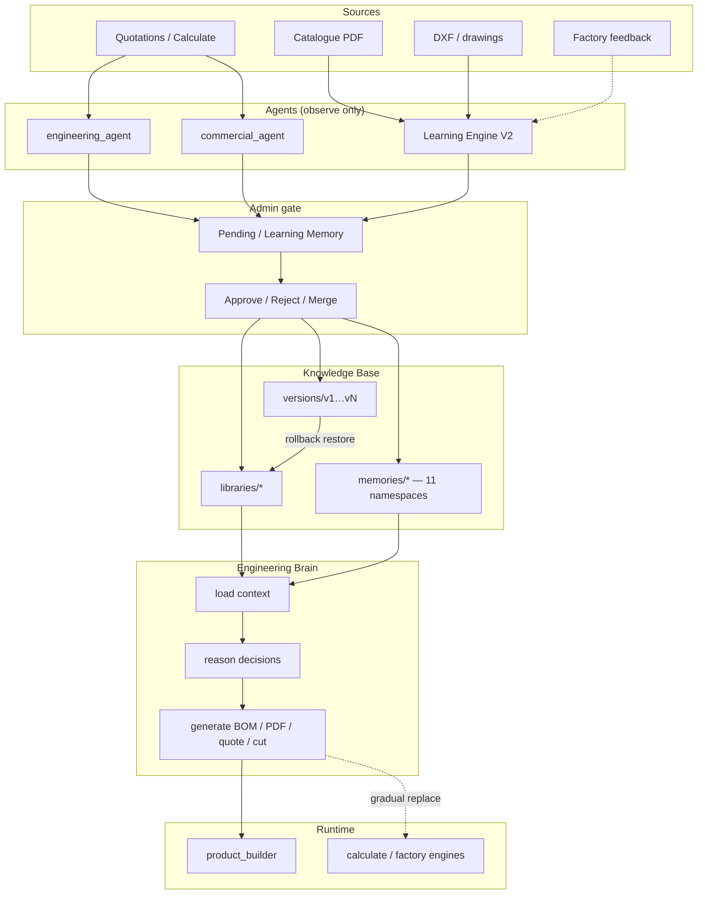
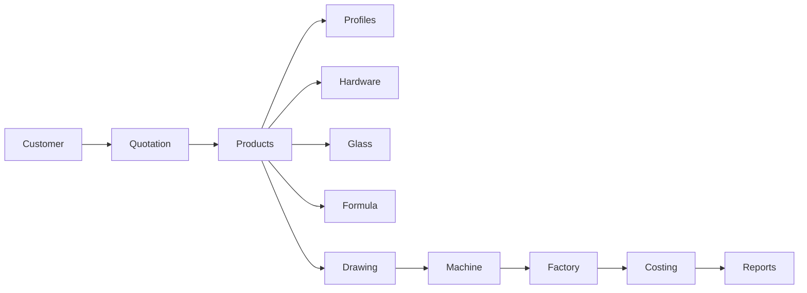

# WEOS Manufacturing Memory Architecture + Engineering Brain

This is **not** chatbot memory. It is an **Engineering Manufacturing Memory System**: continuously learn, organize, version, retrieve, and reuse engineering knowledge — with a hard admin gate before anything reaches production use via the Brain.

## Philosophy

| Role | Allowed |
|------|---------|
| AI / agents | Observe, Suggest, Compare, Explain, Recommend |
| Admin | Approve, Reject, Merge, Version, Rollback |
| Production ERP (`WEOS/products/`) | **Never** auto-written from Memory / Learning / Brain |

**Flow:** Observe → Suggest → Admin Review → Approve → Knowledge Base Version → Production use via Brain

Formulas live as **versioned Formula Memory objects** (history appended). Silent overwrite is forbidden.

---

## Architecture diagram



## Relationship chain



---

## Folder structure

```
WEOS/
  memory/                 # Memory Architecture package
    schemas.py            # JSON models for 11 memory types
    store.py              # CRUD / namespaces / relationships
    admin.py              # approve / reject / merge / version / rollback
    cache.py              # Brain load cache (in-process + file TTL)
    search/
      index.py            # Inverted index + keyword/filter search
  brain/
    engine.py             # load / reason / generate orchestration
  learning/               # Existing V2 — still the extract/approve path
  api/server.py           # /api/memory/* + /api/brain/*

knowledge_base/
  libraries/              # Approved working set (V2)
  versions/vN/            # Immutable snapshots + rollback source
  memories/               # Dedicated memory namespaces
    engineering/
    commercial/
    product/              # overrides / rich Product Memory
    profile/
    hardware/
    glass/
    formula/              # version history lives here
    drawing/
    quotation/
    factory/
    learning/             # observations → suggestions
    relationships.json
    _index/inverted.json
    _cache/
  commercial/             # Existing customer memory + observations
  engineering/            # Existing eng observations
```

**Storage choice:** JSON files on disk (same as Learning Engine V2 today). Fits WEOS portability (`WEOS_KB_DIR`). SQLite can be layered later without changing API shapes.

---

## Separate memories (never mixed)

| Memory | Backing | Purpose |
|--------|---------|---------|
| Engineering | `memories/engineering/` | Overlap, cutting, BOM, nesting, waste, usage packs |
| Commercial | `memories/commercial/` + `commercial/` | Customer / margins / GST / prefs |
| Product | `libraries/product_series` (+ overrides) | Series + eng/commercial formulas + notes |
| Profile | `libraries/profiles` | Dims, wall, kg/m, positions, drawings |
| Hardware | `libraries/hardware` | Brand, rate, unit, install, supplier |
| Glass | `libraries/glass` | Thickness, density, overlap, calc formula |
| Formula | `libraries/formulas` + `memories/formula/` | Versioned expression + history |
| Drawing | `memories/drawing/` | DXF/SVG/PDF, dimension/arrow styles |
| Quotation | `libraries/quotation_patterns` | Logo, terms, warranty, brand colours |
| Factory | `memories/factory/` | Machine, packing, bundle/QR, delivery |
| Learning | `memories/learning/` | Observations + frequency suggestions |

---

## Learning pipeline (unified)

1. **Observe** — `engineering_agent` / `commercial_agent` / `POST /api/memory/observe`
2. **Suggest** — Learning Memory `pending_approval` or V2 pending proposal
3. **Admin review** — Learning Engine UI or Memory browser
4. **Approve** — writes libraries / memories; optional `publish_kb_version`
5. **Brain** — `POST /api/brain/load|reason|generate` reads **approved** KB only
6. **Rollback** — `POST /api/memory/versions/rollback` restores `libraries/` from `versions/vN`, then publishes a **new** auditable version

Agents already in-tree (`commercial_agent`, `engineering_agent`, `product_builder`, `material_formulas`) remain the observation / builder layer; Memory + Brain unify retrieval and orchestration.

---

## API surface

### Memory
- `GET /api/memory/status` · `GET /api/memory/types`
- `GET|POST /api/memory/{type}` · `GET /api/memory/{type}/{id}`
- `POST /api/memory/{type}/{id}/approve|reject` · `POST /api/memory/{type}/merge`
- `POST /api/memory/observe`
- `GET|POST /api/memory/search` · `POST /api/memory/search/rebuild`
- `GET /api/memory/versions` · `POST .../publish` · `POST .../rollback`
- `GET /api/memory/meta/relationships`

### Brain
- `GET /api/brain/status`
- `POST /api/brain/load` · `GET /api/brain/load/{series_id}`
- `POST /api/brain/reason`
- `POST /api/brain/generate` → BOM, drawing, PDF, quotation, weight, cost, packing, machine_cutting

---

## Caching

- Keyed by `(series, productType, customer, kbVersion)`
- In-process dict + file under `knowledge_base/memories/_cache/`
- TTL ~2–3 minutes; **invalidated** on approve / version publish / rollback

---

## Search strategy

Pragmatic **inverted index** over all memory namespaces (`knowledge_base/memories/_index/inverted.json`).

Supports queries like:
- sliding systems with 30mm track
- products using Premium Handle
- quotations with Black Texture
- formulas related to Glass Width
- products compatible with Series S29

### Honest gaps
- No vector embeddings / ANN semantic search yet (documented; same `search()` API can host them later)
- No OCR/vision catalogue understanding beyond existing heuristic PDF text extract
- Factory engines still primarily read `WEOS/products/*`; Brain is the bridge to gradually replace hardcoded ERP tables
- Full `rules/*.json` packs are not auto-generated from Memory on approve (Product Builder publish remains explicit)

---

## Version control + rollback

- Approve → optional snapshot `versions/v{N}/` (immutable)
- Rollback → copy `vN` → working `libraries/`, then **publish v{N+1}** with `action: rollback` (history never rewritten)
- Production products untouched

---

## UI

Learning Engine → **Memory & Brain** tab:
- Memory browser (11 types)
- Search box
- Brain load / generate for a series
- KB version list + rollback

---

## Smoke test

```bash
python -m WEOS.memory.smoke_test
```

Covers: observation → suggest → approve → new KB version → Brain load (S29-like) → rollback.
