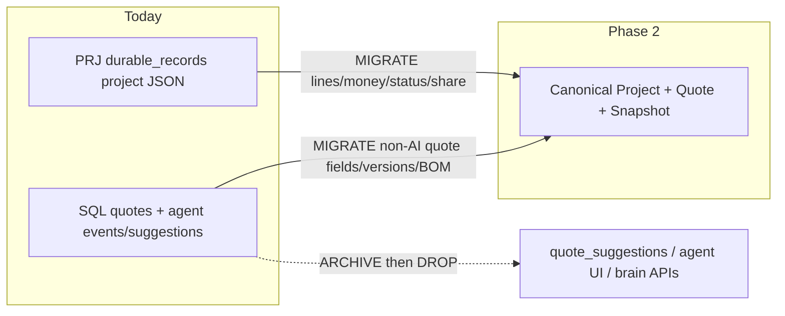

# WEOS Target Architecture & Gap Plan (Phase 2)

**Status:** Planning document only — **no code implemented**  
**Date:** 2026-09-09 (revised against master blueprint)  
**Primary current-system authority:** `_audit/WEOS_CURRENT_SYSTEM_MASTER_BLUEPRINT.md` (**PARTIAL** restore — §1–§2 only; audit date 8 Sep 2026; working tree at HEAD `32b0c950…`)  
**Secondary / older docs (do not override master findings):** `WEOS/BLUEPRINT.md` (company/FY capacity notes, smoke table); code under `WEOS/`  
**Missing companion (referenced by master, not on disk):** `WEOS_SOURCE_EVIDENCE_ATLAS.md`  
**AI stance:** `WEOS/AI_BLUEPRINT.md` is **historical only**. Phase 2 product scope has **AI fully REMOVED** (user mandate). Master blueprint already states memory is deterministic JSON rules / keyword search — **not** an LLM service; Phase 2 retires Agent dock / brain / mutating memory product surfaces entirely.

### Master-blueprint findings this plan must solve

| # | Master finding (Confirmed / Architectural risk) | Phase 2 response |
|---|---|---|
| 1 | `scheduleSave()` = browser draft only; edit ≠ server save | Formal Autosaved Draft (server) vs Saved to WEOS vs crash backup (§15 / §24) |
| 2 | Project save can succeed after SQL mirror fails → JSON sole copy | One authoritative SQL business store; FS/JSON cache only; fail closed on SoT write (§2) |
| 3 | Project PDF recalculates + loads live branding/customer — not frozen archive | PDF only from immutable `QuoteSnapshot` (§9–§10) |
| 4 | Mutations/exports often ungated while some reads are session-gated | Server-side ownership on all sensitive routes (§13) |
| 5 | QR prefers human quote numbers; lookup not company-scoped; slashes break single-segment routes | Opaque share token from snapshot; company-scoped public lookup (§10) |
| 6 | Rich PDF ok; template/fallback can omit content or **substitute demo terms** | No silent term substitution; snapshot carries terms/specs (§10) |
| 7 | Memory = deterministic rules, not LLM | AI/agent product paths **REMOVED**; deterministic libraries may remain as non-mutating seeds only (§12) |
| — | Central problem: overlapping ownership (PRJ FS+SQL mirror, Agent SQL quotes, profiles, branding, browser drafts, KB) | Merge to one quotation aggregate (§2) |
| — | Safeguards exist but narrower than UI labels (item snapshots, unavailable-product handling, share tokens, versions) | Extend to full issued-document immutability — do not trust labels alone |
| — | Older architecture docs drift from current code | Prefer master blueprint + code over `WEOS/BLUEPRINT.md` / `AI_BLUEPRINT.md` when they conflict |
| — | Dual entry points: WEOS web vs CLI `cad_engine`/`app`; `run_factoryos.py` → absent package | Classify by entry point; KEEP EXTERNAL / ARCHIVE — do not delete for name overlap (§14, §34) |

---

## 0. Executive decisions (read first)

| Decision | Target |
|---|---|
| Primary pipeline | MASTER DATA → PROJECT GEOMETRY (DesignDocument / Assembly / Element) → ENGINEERING CONFIG → BOM → COSTING → SELLING PRICE → **QUOTE FAMILY / REVISION SNAPSHOT** → APPROVAL → **PROJECT BUDGET** → ORDER → MANUFACTURING → INSTALLATION |
| Universal Canvas | **One** shared engineering canvas; designs are structured engineering objects that **flow into quotation** (no disconnected placeholders / recreate-unrelated-products). Engines stay plugins. Advanced member/cell design workflow = **ACD.*** extension (queued UX C → Canvas D–G) — not a second canvas. |
| Commercial quotes | **Quote Family** (scope letter A/B/C) ≠ **Quote Revision** (history). Human numbers never PK. Group Quote Builder is the one workflow (single item = one-line group quote). |
| Customer / Project | Immutable `customer_id` / `project_id` PKs; mobile/name never FK. Deterministic match + conflict flags; create/find customer during quote form. |
| Approval / Budget | Any revision may be approved (not auto-latest); approval freezes snapshot; project budget = sum of **approved quote families** only. |
| Payments | **Ledger** of allocations (not a single advance field); running balance; statement PDF. |
| AI | **REMOVED** — do not reintroduce. |
| Designers | Adapters + regression first; do not rewrite working engines. |
| Deletion | Proof criteria only; no deletes in planning. |

---

# 1. Target architecture

## 1.1 Architectural principle

Stages are **connected by IDs and immutable snapshots**, not merged into one mutable “project blob.”

```text
Company (tenant)
  └── Customer (immutable customer_id; identities: GST, normalized mobile, …)
        └── Project (immutable project_id; unlimited per customer)
              ├── DesignDocument → Floor → Location → Assembly → Elements + Connections
              │     └── ProductConfiguration → engine → Element BOM/Cost
              ├── QuoteFamily[]     (human no. XYZ12345, XYZ12345A/B/C = additional SCOPE, not revision)
              │     └── QuoteRevision[]  (full snapshots; branchable; parent lineage)
              │           └── QuoteSnapshot (immutable issued body + design freeze)
              │                 └── QuoteApproval (any revision may be approved)
              ├── ProjectBudget     (from APPROVED families only)
              ├── PaymentLedger[]   (allocations → customer + project [+ optional family/revision])
              └── ProjectChangeHistory (structured timeline)
                    └── Order → ManufacturingPackage / InstallationPackage
```

**Invariant:** Masters/customer/project profile edits must **not** rewrite issued snapshots. Canvas geometry survives series switches. Family letter ≠ revision.

## 1.2 Runtime layers (target)

| Layer | Responsibility | Authoritative? |
|---|---|---|
| Browser UI | **Universal Canvas** host + contextual property panel; local temp only | No |
| Canvas layer (new progressive module) | Coords, viewport, zoom/pan, selection, transforms, grouping, connections viz, undo/redo UI, labels | No (edits → server draft) |
| Product engine plugins | Engineering, materials, BOM, costing, product properties | Calc truth |
| API | Auth, company isolation, draft/revision/issue orchestration | Gate only |
| Domain / repositories | DesignDocument, Assembly, Element, Connection, Quote lifecycle | Yes |
| SQL business DB | Normalized entities (§3 + Universal Canvas section) | **Yes** (fail closed) |
| Product/config JSON / KB libraries | Seeds / imports only | Config seeds |
| Filesystem | Cache / rehydrate only | Cache only |

## 1.3 What stays deterministic (engineering plugins)

Engines remain **plugins** called by the canvas/domain layer — **not rewritten** as first migration:

- Window / door / fixed / fold / casement: `pipeline.py`, `geometry_engine.py`, `svg_export.py`, glass/hardware/bom/quotation engines
- Railing: `railing_engine.py`, `railing_runs.py`, `railing_materials.py`
- Ventilator / shower: `ventilator_engine.py`, `shower_engine.py`
- Louvers / pergola / surface (ACP etc.): `panel_fills.py`, `special_schematics.py`

Phase 2 extracts **shared canvas** concerns; engines keep product physics.

---

# 2. Canonical source-of-truth design

## 2.0 Master diagnosis (overlapping ownership)

Per `_audit/WEOS_CURRENT_SYSTEM_MASTER_BLUEPRINT.md` §1, today’s state is **not** one quotation aggregate:

| Owner path | Role today | Problem |
|---|---|---|
| Ordinary cart → PRJ project document | Filesystem store **mirrored** to SQL `durable_records` | Mirror can fail while save “succeeds” → JSON sole copy (**Architectural risk**) |
| Agent dock → SQL quotes + child tables | Parallel quote model | Not the same immutable aggregate as PRJ |
| Product rules (`WEOS/products/`) | Engineering/pricing config | Live rules can drift under reissued PDFs |
| Customer profiles / company branding | Mutable live docs | PDF regen pulls **current** branding/customer — not issued freeze |
| Browser drafts (`scheduleSave`) | Local only | UI may imply saved; server never saw the edit |
| Knowledge libraries | Deterministic rules/observations | Must not be treated as second SoT or LLM brain |

**Target:** one authoritative database-backed business model whose issued form is `QuoteSnapshot`. All of the above become either (a) that model, (b) versioned masters feeding new calcs, (c) import seeds, or (d) crash-backup only.

## 2.1 One authoritative business store

| Concern | Today (overlapping) | Target |
|---|---|---|
| Live ERP projects / carts | FS project JSON + SQL `durable_records` mirror via `factory/project_store.py` | SQL authoritative; FS optional cache; **write fails if SoT write fails** |
| Company index | JSON blob `company:{GST}:index` (`company_index.py`) | SQL indexed tables (`project_index` / query views) |
| Company profile / sessions | JSON in durable_records (`company_store.py`) | SQL `companies` + `sessions` (+ logo blob table); branding **copied into snapshot** at issue |
| Agent / SQL quotes | `db/models.py` `quotes` + children via `db/quote_store.py` + `/api/quotes` | Absorbed into canonical Quote (strip AI children / Agent dock product) |
| Advances | SQL `customer_advances` | Keep / harden company_gst FK |
| Product library | FS `products/` + SQL `library_files` | Versioned ProductSystem / masters in SQL; JSON import path retained |
| Browser | `scheduleSave` draft + GST/session + series design map | Session + **unsaved draft backup only** (not authoritative) |
| Memory / learning / brain / agent | `knowledge_base/`, `/api/memory`, `/api/learning`, `/api/brain`, `/api/agent` | **Out of product scope** (retire surfaces); deterministic library JSON may remain as import seeds only |

## 2.2 PRJ path × Agent quote path — merge plan (AI removed)



**Rules:**

1. **Canonical identity:** one `Quote` row per commercial quotation document; `project_id` + `company_id` required.
2. **PRJ documents** become Projects with `ProjectItem`s; cart `lines[]` → items linked to geometry + config + BOM/cost snapshots.
3. **SQL `quotes`** that already hold `lines`, `bom`, `share_token`, `company_gst`, `quote_versions` are the closest schema seed — **reuse/evolve**, do not invent a third store.
4. **`quote_suggestions`, Agent analyze, brain recommend, memory apply** — **removed** from target product. Durable quote storage that is useful **survives without AI**.
5. **`quote_agent_events`** may be renamed later to generic `quote_audit_events` (human/system audit), not “agent.”

## 2.3 Authoritative vs non-authoritative

| Data | Authoritative store | Allowed copies |
|---|---|---|
| Company, User, Customer, CustomerIdentity, Project | SQL | None for writes |
| Floor, Location, DesignDocument, Assembly, Element, Connections, ProductConfiguration, GeometryRevision | SQL | Canvas local temp only |
| QuoteFamily, QuoteRevision, QuoteSnapshot, QuoteApproval, QuoteItem (ENGINEERED\|MANUAL) | SQL | PDF/cache from snapshot only |
| CommercialProductMaster, UnitRegistry, QuoteItemMedia | SQL (+ blob) | Cache |
| ProjectBudget, ProjectPaymentLedger, ProjectChangeHistory | SQL | Statement PDF render |
| Issued snapshot designs (geometry/config/visual) | Inside QuoteSnapshot | Canvas may reload from snapshot for view |
| Draft DesignDocument / draft Family revision | SQL draft | Browser local temp + crash backup |
| Product masters | SQL versioned masters | JSON seed / Excel import |
| Canvas SVG preview | Never SoT | Ephemeral render |
| Knowledge libraries | Optional import → masters | Read-only seed |

---

# 3. Proposed database / domain model

Company isolation key: **`company_id`** (stable UUID/int). GSTIN remains unique business attribute on Company, not the only FK forever (today many paths key by `companyGst` string — migrate carefully).

For every entity: **Ownership | Lifecycle | Relationships | Mutable? | Isolation | Versioning**

### Company
- **Owns:** Users, Customers, Projects, Masters (company-scoped overrides), Quotes, Orders  
- **Lifecycle:** active / suspended  
- **Mutable:** profile, bank, terms templates (template changes do not rewrite old snapshots)  
- **Isolation:** root tenant  
- **Versioning:** profile history optional; terms **copied into QuoteSnapshot**

### User
- **Owns:** sessions, authored revisions  
- **Lifecycle:** active / disabled  
- **Rel:** Company 1—N User  
- **Mutable:** credentials/roles  
- **Isolation:** company_id  
- **Versioning:** n/a (audit log)

### Customer
- **PK:** immutable `customer_id` (UUID/int) — **never** mobile or name as PK/FK  
- **Identities (searchable, not PK):** normalized mobile(s), GSTIN, display name, email  
- **Owns:** projects, payment ledger rows, bill-to profile  
- **Lifecycle:** active / archived  
- **Match (deterministic):** Customer ID → GST → normalized mobile; **conflicts flagged, never silent merge**  
- **Create-during-quote:** one form can create/find customer + link project + create QuoteFamily  
- **Today:** FS/DB profile keyed by name slug (`customer_store.customer_key`); Agent SQL `customers.mobile` **globally unique**; profile routes often ungated  
- **Isolation:** `company_id` required  
- **Snapshots:** customer master may change later; issued QuoteSnapshots keep frozen bill-to copy

### CustomerIdentity
- Rows for mobile/GST/etc. with `normalized_value`, `raw_value`, `kind`, uniqueness per company  
- India: +91 / 0XXXXXXXXXX / 10-digit → one searchable identity; international-extensible

### Project
- **PK:** immutable `project_id`  
- **Rel:** Customer N—1; Company N—1; unlimited projects per customer  
- **Match:** explicit Project ID **or** normalized name **within customer**; ambiguous → user chooses  
- **Owns:** DesignDocument, QuoteFamilies, ProjectBudget, change history  
- **Human label:** project name / optional display code — never commercial quote PK  
- **Today:** `PRJ-{year}-{seq}` via `project_store.new_project_id`; customer often free-text on doc  

### QuoteFamily
- Commercial **scope** container on a Project (base `XYZ12345`, additional scopes `XYZ12345A` / `B` / `C`)  
- Letter suffix = **additional scope**, **NOT** a revision  
- **Statuses (proposed):** Draft | Sent | Under Revision | Approved | Rejected | Superseded | Cancelled  
- **Internal PK:** `quote_family_id`; human number display-only, concurrency-safe allocator  
- **Today gap:** one PRJ doc ≈ one commercial quote; version suffix `A1` in `quote_number.py` conflates revision with number; cart `cartQuoteGroups` are UI sections only

### QuoteRevision
- Full immutable **content snapshot** of a family at a point (geometry+config+visual+BOM+cost+terms+groups)  
- Branchable from any prior revision (`parent_revision_id` lineage)  
- Correcting an old issued quote = **new revision** (never mutate old)  
- **Today:** project `version` + `projects/versions/*_vN.json` undo stack; SQL `quote_versions` on Agent path — **ADAPT/MIGRATE**, don’t duplicate blindly

### QuoteApproval
- Explicit approval record pointing at **exact QuoteRevision** (any revision may be approved, not auto-latest)  
- Freezes that revision’s QuoteSnapshot; supersedes prior approval on same family as needed  
- **Today:** `set_project_status(... approved ...)` + scanner `apply_scanner_status` — **ADAPT** into QuoteApproval

### QuoteItem (common commercial line)
- **`source_type`:** `ENGINEERED` | `MANUAL`  
- Common money/group/floor fields; engineered_ref JSON **or** manual_payload JSON  
- Optional `commercial_product_master_id` + version; media; manufacturing_mode  
- Lives under QuoteRevision (or draft family); snapshotted immutably on issue

### CommercialProductMaster
- Company-scoped saved manual (and hybrid) catalogue; versioned; historical quotes pin `master_version_id`

### QuoteItemMedia
- Photo/blob for engineered design photo or manual product photo; content hash into snapshot

### UnitRegistry
- Selling/cost units + conversion metadata (never invent)

### PaymentLedger / PaymentAllocation
- Prefer name **ProjectPaymentLedger** — migrate from `customer_advances` without data loss

### ProjectChangeHistory
- Structured timeline: quote created/sent/revised/approved/rejected, payment posted, design revision, status changes  
- **Today:** project `revisionLog` / history JSON — **ADAPT**

### Floor
- **Owns:** locations  
- **Lifecycle:** mutable until project freeze / order snapshot  
- **Rel:** Project 1—N Floor  
- **Mutable:** name, level index, elevation metadata  
- **Isolation:** via project  
- **Versioning:** via DesignDocument / GeometryRevision  
- **Today:** **absent** as structured data (only free-text `locationName` on lines)

### Location
- **Owns:** assemblies (and/or standalone items)  
- **Lifecycle:** mutable  
- **Rel:** Floor 1—N  
- **Mutable:** name/code  
- **Today:** `line_kind.line_location_name` string only — promote to entity

### DesignDocument
- **Owns:** scene graph for a project (or floor scope), GeometryRevision stream  
- **Payload:** structured geometry (elements, transforms, groups, connections) — **not SVG-as-SoT**  
- **Mutable:** draft revisions; issued snapshots freeze a revision id  
- **Isolation:** company via project  
- **Today:** no first-class scene; cart `lines[]` + optional `previewSvg` blobs

### Assembly
- **Owns:** child Elements + Connections  
- **Lifecycle:** draft → configured → quoted → ordered  
- **Rel:** Location N—1; DesignDocument  
- **Mutable:** membership/layout until freeze  
- **Mixed products allowed** (window + grill + railing children, etc.)  
- **Today:** not first-class (hint only: pergola “window_in_pergola” comment in UI)

### Element (replaces flat ProjectItem/Opening as leaf)
- **Owns:** ElementGeometry + ProductConfiguration link  
- **Geometry (independent of series):** W, H, X, Y, orientation, sill height, relative offsets, parentElementId, stable elementId  
- **Lifecycle:** draft → engineered → quoted  
- **Rel:** Assembly; optional parent Element  
- **Survives series/system switch** (IDs/dims/location/parent retained)  
- **Today:** cart line (`lineId`) ≈ soft element; no X/Y/parent/connection model

### Connection
- **Owns:** explicit join between two Elements (or Element↔structure)  
- **Fields:** connectionId, type (frame-to-frame, mullion share, railing wall return, sill seat, …), fromElementId, toElementId, params, BOM contribution rules  
- **Lifecycle:** mutable in draft; frozen in snapshot  
- **Constraint:** connection engine may add shared hardware/profiles **without double-counting** Element BOMs  
- **Today:** **absent**

### ElementGeometry / GeometryRevision
- Structured pose + outline params for canvas + engines  
- GeometryRevision = immutable revision of DesignDocument content hash / JSON  
- Evolves from today’s DesignGeometry concept + `DrawingModel` polylines/segments (engine-local)

### ProjectItem / Opening (compat alias)
- May remain as a **view** over Element where assembly has a single opening element during migration

### ProductConfiguration (was EngineeringConfiguration)
- **How** to build this element: series/system@version, hardware, glass, mount, finish, presets  
- Separate from ElementGeometry  
- Fed to product engine plugin

### DesignGeometry (legacy name)
- Absorbed into **ElementGeometry** + Assembly layout; keep term in adapters during migration

### DesignRevision
- Prefer **GeometryRevision** on DesignDocument; QuoteRevision remains commercial

### ProductSystem
- Top-level catalogue family (window sliding, railing, shower, …)  
- Maps today’s `products/<id>/product.json`

### WindowSeries
- Versioned series master (sections, track options, limits)  
- Evolves from `section_catalogue.py` + product JSON geometry rules

### RailingSystem
- Versioned railing system master (bottom kinds, mounts, stud rules, default materials)  
- Evolves from `railings_stub` + `railing_materials` + engine defaults

### ProfileMaster / MaterialMaster / HardwareMaster / GlassMaster / FinishMaster / AnchorMaster / BracketMaster / ConnectorMaster / EndCapMaster
- Versioned SKUs with units, rates, compatibility tags  
- **MASTER CURRENT** row + **version history** table (or append-only versions with `is_current`)  
- Quote/BOM lines store **master_version_id** + denormalized description/rate

### EngineeringRule
- Deterministic rule documents (formulas, spacing, stud hierarchy) bound to system/series version  
- **Not** AI memory proposals

### ConfigurationPreset
- Named construction choices **without** project dimensions (e.g. “2-track mesh mid”, “side-mount stud 50”)  
- Applied onto ElementGeometry to produce ProductConfiguration

### EngineeringConfiguration
- Alias of **ProductConfiguration** during migration (series/system/hardware/glass/mount on an Element)

### BOM / BOMLine
- Hierarchy: **Element BOM → Assembly BOM (dedup via Connections) → Floor → Project**  
- Generated from geometry + configuration + masters + connection engine  
- Lines: category, master_version_id, qty, unit, explicit **NONE** / included flags  
- Issued quotes freeze full hierarchy inside QuoteSnapshot

### CostCalculation / CostLine
- Same roll-up hierarchy as BOM; selling price at chosen commercial grain (element/assembly/project)

### Quote / QuoteOption / QuoteRevision / QuoteSnapshot
- Superseded naming: prefer **QuoteFamily** + **QuoteRevision** + **QuoteApproval** + **QuoteSnapshot** (above). Legacy “Quote” word maps to Family during migration.

### Order
- Created from approved QuoteFamily revision snapshot(s)  
- Lifecycle: confirmed → in_production → installed → closed

### ManufacturingPackage / InstallationPackage
- Derived from approved engineering + BOM snapshot  
- **Must preserve** Floor → Location → Assembly → Element hierarchy (cut-list / install notes grouped accordingly)  
- Immutable once released (change order = new package revision)

---

**Normalization note (SQLAlchemy-friendly):** Prefer tables for Project, Floor, Location, Assembly, Element, Connection, DesignDocument, GeometryRevision, Quote, QuoteSnapshot, BOM headers/lines, Cost headers/lines, Masters (+ versions). Use JSON columns for engine-specific config/geometry payloads and scene extras — **not** one rigid table per tiny concept. Indexes on `company_id`, parent FKs, `share_token`.

---

# 4. Existing-to-target mapping

| Current artifact | Target entity / fate |
|---|---|
| Cart `lines[]` in PRJ JSON | Element (+ ProductConfiguration) under default Assembly/Location/Floor |
| `locationName` on lines | Location (+ Floor) |
| `previewSvg` / livePreview DOM | Non-authoritative canvas render of DesignDocument |
| `DrawingModel` (`factory/types.py`) | Engine-local drawing IR → adapt into ElementGeometry / scene nodes |
| `scheduleSave` browser draft | Local temp only |
| Project undo/redo API | Eventually canvas undo stack + GeometryRevision; keep project undo until then |
| PRJ durable_records / FS | Migrate → SQL Project + DesignDocument |
| Agent SQL quotes | Merge → canonical Quote (non-AI) |
| Product engines + SVG exporters | **KEEP** as plugins; WRAP with adapters |
| `#livePreview` + preview zoom CSS | Seed of Universal Canvas viewport (EXTRACT) |
| `railTools` / `showerTools` / `ventTools` | Contextual property panel plugins (WRAP) |
| Company / customer / advances | Company / Customer / Advance |
| Knowledge/agent surfaces | Retire product exposure (AI out of scope) |

---

# 5. Railing architecture

## 5.1 Masters
RailingSystem version binds: bottom systems (studs, SS pillars, continuous rail, aluminium block), mount defaults, handrail, glass, anchors, brackets, connectors, end caps, finishes, commercial unit (RFT/RMT).

**Evidence today:** `products/railings_stub/product.json`, `factory/railing_materials.py`, `knowledge_base/libraries/railing_materials/`, engine defaults in `railing_engine.py`.

## 5.2 Geometry (independent of system)
Shapes already in engine: straight, L, U, polyline, arch, staircase (`railing_engine._shape`, `compute_railing`).

Geometry payload: runs/segments, length, height/glass height, arch span/rise/radius, stair riser/tread/steps/floor height, panels, gaps, edge insets.

## 5.3 Staircase
**Keep** `compute_stair_geometry` — uses `atan(riser/tread)`, total rise/run/slope, floor mismatch flag (`FLOOR_RISE_TOL_MM`). Glass panels via `compute_stair_glass_panels` (horizontal width × vertical height for parallelogram area). Multi-flight via `railing_runs.build_stair_flights`.

**Tests:** `WEOS/_smoke_stair_railing.py`, `WEOS/_smoke_normal_railing.py`, `WEOS/_smoke_easy_railing.py`.

## 5.4 Side-mount / stud rules
**Keep** hierarchy in `infer_railing_mount` / `beam_overlap_applies` / `side_stud_*`:

| Bottom | Default mount |
|---|---|
| studs | side_mount |
| SS pillars / continuous rail / aluminium block | top_mount |
| stairs + explicit step | step_mount |

Configurable overrides via explicit mount lock. Target: move magic numbers (edge, spacing, every-Nth-step) into **EngineeringRule** on RailingSystem version.

## 5.5 BOM
Target: every category either **included with qty**, **explicit NONE** (not applicable), or **error** if required and missing. No silent drop that looks like ₹0 material.

**Gap:** current consolidation paths can skip/omit lines (`railing_materials` seed skip counters; BOM engines append only present items). Phase 2 requires explicit NONE rows for scoped categories on RailingSystem.

## 5.6 Costing
**Keep** `compute_railing_cost_cascade` (net vs purchased glass, wastage explicit, overhead, markup, selling, per RFT/RMT). Wire cascade outputs into CostCalculation entity rather than only ephemeral quote dict.

---

# 6. Window architecture

## 6.1 Series master
**Evolve** `section_catalogue.py` (`list_series`, `get_series`, Excel import) + active product `29mm_sliding` rules into versioned **WindowSeries**.

Stub products (`35mm_sliding`, etc.) stay catalogue entries until engines exist — switching series must not invent millimetres.

## 6.2 Hardware master
**Evolve** `hardware_catalogue.py` + product `materials[]` with `mapToHardware` into HardwareMaster versions. Rules: `apply_hardware_rules`, `hardware_bom_for_product`.

## 6.3 Engineering / BOM
**Keep** `pipeline.generate_job` order: product → geometry → glass → hardware → brush → track → materials → cut-list → weight → BOM → quotation.

Separate stages in storage even if one API call computes them.

## 6.4 Cost / selling
**Keep** `quotation_engine.compute_quotation` + live pricing helpers; persist CostCalculation + selling breakdown on snapshot.

## 6.5 Arch windows
Today window “arch” is largely **drawing meta** (`topShape` / `curveRiseMm` in `project_engine`, `svg_export`) — not full semicircular/segmental engineering glass/cut geometry comparable to railing arch.

**Decision:** MODIFY geometry_engine / glass sizing to treat semicircular & segmental as **engineering geometry** (true developed lengths / glass shapes), not decoration-only. Preserve flat path. Add regression smokes before enabling in quotes.

## 6.6 Configuration presets
Today: browser `WEOS_SERIES_DESIGNS_KEY` localStorage map in `website/index.html`.  
**Target:** server ConfigurationPreset (company-scoped), browser backup only.

---

# UNIVERSAL CANVAS & ASSEMBLY ARCHITECTURE

> Freeze requirement set: one engineering canvas + assembly-first geometry; product engines remain plugins. **AI remains OUT OF SCOPE.** Planning only — no engine rewrites in the first architecture batches.

## UC.1 Principle — one universal engineering canvas

WEOS presents **one** interactive engineering canvas for windows, ventilators, doors, fixed panels, grills, railings, showers, louvers/pergola/surface panels, and future products.

Product calculation remains in **separate engine plugins**. The canvas never invents millimetres that engines own.

## UC.2 Ownership boundary

| Universal Canvas owns | Product engine plugins own |
|---|---|
| Coordinate system, viewport, zoom/pan | Product-specific engineering geometry rules |
| Selection, multi-select, move/resize | Materials, hardware selection rules |
| Dimensions display, measure tools | BOM generation for the element |
| Align, snap, rotation | Costing / selling cascade for the element |
| Grouping, parent/child scene links | Product properties & validation |
| Positioning, connections **visualization** | Connection **engineering contributions** (via connection engine API) |
| Undo/redo (canvas), copy/dup/delete | |
| Labels, IDs, visibility layers | |
| Geometry save/load orchestration (to server draft) | |
| Floor / location association UX | |

## UC.3 Current drawing / designer inventory (source evidence)

| Component | What it does today | File / module | Recommendation |
|---|---|---|---|
| Cart live preview host | Single DOM `#livePreview` swaps SVG by product world | `WEOS/website/index.html` (`refreshPreview`, `livePreview`) | **EXTRACT TO UNIVERSAL CANVAS** (viewport shell) |
| Preview zoom (CSS scale + wheel) | Fit / ± zoom; overflow scroll when zoomed — **not** CAD pan/select | `index.html` `previewZoomValue`, `setPreviewZoom`, `.preview.zoomed` | **EXTRACT TO UNIVERSAL CANVAS** (extend to true pan/coords) |
| Cart line selection | `state.selectedLine` index; highlights table row | `index.html` | **WRAP WITH ADAPTER** → canvas element selection |
| Window / door / fold / casement preview | POST `/api/preview` → SVG string | `api/server.py`, `svg_export.render_svg_string`, `geometry_engine` | Engine: **KEEP**; SVG draw path: **WRAP WITH ADAPTER** |
| `DrawingModel` IR | Polylines/segments/dims for window drawings | `factory/types.py`, `geometry_engine.build_drawing` | **KEEP** as engine IR; map into scene nodes later |
| SVG export / elevation | Window elevation SVG + line elevation helper | `factory/svg_export.py` (`elevation_svg_for_line`, `preview_svgs_for_drawing`) | **KEEP** / **WRAP WITH ADAPTER** |
| Dimension helpers | Non-interactive dim geometry for drawings/DXF | `factory/dimensioning.py` | **KEEP** (engine/PDF); interactive measure = canvas (**REBUILD** thin UI) |
| DXF export | Optional CAD export from DrawingModel | `factory/dxf_export.py` | **KEEP EXTERNAL** capability |
| Image / PDF SVG sanitize | ViewBox normalize, PNG raster for PDF | `factory/image_engine.py` | **KEEP** (render pipeline, not canvas) |
| Elevation cache | Fingerprinted SVG/PNG cache per line | `factory/elevation_cache.py` | **KEEP** / adapt keys to Element ids |
| Railing designer UI | Form/run cards, shapes, stair steps; not freeform canvas edit | `index.html` `#railTools`, `renderRailRunRows`, `railingCalc` | Property panel: **WRAP WITH ADAPTER**; geometry edit → canvas later |
| Railing SVG engine | Plan/elevation/stair/arch SVG from cfg | `factory/railing_engine.py` `railing_svg`, `_svg_*` | **KEEP** plugin |
| Shower designer UI | `#showerTools` + calc | `index.html`, `shower_engine.py` `shower_svg` | **WRAP WITH ADAPTER** + **KEEP** engine |
| Ventilator designer UI | `#ventTools` + calc | `index.html`, `ventilator_engine.py` `ventilator_svg` | **WRAP WITH ADAPTER** + **KEEP** engine |
| Louvers / pergola / surface schematics | Special SVG builders | `special_schematics.py`, `panel_fills.py` | **KEEP** plugins |
| Grill / dedicated door designer | No separate interactive canvas; doors/fixed via window systems + stubs | `products/*_stub`, window `system` modes | Future plugins on same canvas — **REFACTOR LATER** |
| Project undo/redo | Server project history, not canvas stack | `project_store.undo_project`, `btnUndo` | **KEEP** until canvas undo; then **WRAP** |
| Design photo overlay | Photo attach per line | `design_photo` API + UI | **KEEP** as element media |
| Pointer hit-testing / multi-select / snap / align / grouping | **Not implemented** as CAD tools | — | **REBUILD** inside Universal Canvas |
| Assembly / Connection model | Absent (pergola nested-window note only) | `index.html` comment `window_in_pergola` | **REBUILD** domain + canvas viz |
| Floor structured data | Absent | `locationName` string only | **REBUILD** |

**Verdict:** There is **no** reusable shared CAD canvas library today — only a **shared preview DOM + CSS zoom** and **many product-specific SVG generators**. Universal Canvas is an extraction + new interaction layer, **not** a greenfield delete of engines.

## UC.4 DesignDocument / scene model

Authoritative geometry is a **structured DesignDocument** (elements, transforms, groups, connections, floor/location refs), versioned by **GeometryRevision**.

SVG / PNG / DXF are **projections** for preview/PDF/export — never the sole SoT (aligns with master: browser not authoritative).

Evolve from cart lines + optional `DrawingModel` metadata; do not require one SQL column per vertex.

## UC.5 Assembly first-class

`Location` hosts one or more **Assemblies**. An Assembly is a container of Elements + Connections with its own label and commercial roll-up.

Single-product quotes use a trivial Assembly of one Element (compat with today’s cart line).

## UC.6 Child Element geometry independence

Each Element stores at least: `elementId`, `width`, `height`, `x`, `y`, `orientation`, `sillHeight`, `relativeTo`, `parentElementId`, product world, and ProductConfiguration ref.

Engines read ElementGeometry + ProductConfiguration; they do not own global scene coordinates.

## UC.7 Mixed products in one Assembly

Allowed: e.g. window + grill + fixed panel + railing return in one assembly. Canvas shows all; each element dispatches to its plugin.

## UC.8 Connection model

Explicit `Connection` records (type, endpoints, parameters). Canvas visualizes; **connection engine** (deterministic, non-AI) computes shared BOM deltas.

## UC.9 Connection engine & BOM double-count rules

1. Each Element produces Element BOM.  
2. Connections produce Connection BOM lines tagged with `connectionId`.  
3. Assembly BOM = union with **dedup keys** (shared mullion/profile/hardware once).  
4. Missing optional → NONE; required missing → error.

## UC.10 Series / system switch survival

Switching WindowSeries / RailingSystem regenerates ProductConfiguration + Element/Assembly BOM/cost but **retains** element IDs, W/H/X/Y, location, parent, connections (unless connection type incompatible — then flag, don’t silently drop geometry).

## UC.11 One contextual property panel

Replace stacked always-visible `railTools` / `showerTools` / `ventTools` / window form sprawl with **one** property panel that loads the plugin UI for the current selection (multi-select shows shared props only).

## UC.12 Floor as structured data

`Project → Floor → Location → Assembly → Elements` (and Connections). UI association is a canvas responsibility; persistence is SQL SoT.

## UC.13 Railing on Universal Canvas

- **KEEP** `railing_engine` compute + SVG as plugin.  
- Scene pose (placement on floor plan / elevation) moves to canvas.  
- Run/segment editing migrates from form cards → canvas tools over time (**WRAP** then progressive EXTRACT).  
- Stair atan / mount / cost cascade stay in engine.

## UC.14 Window (and kin) on Universal Canvas

- **KEEP** `geometry_engine` / `pipeline` / `svg_export`.  
- Opening rectangle + partitions become ElementGeometry on canvas.  
- Arch engineering remains engine MODIFY (see §6.5), rendered via canvas.

## UC.15 BOM / Cost / Mfg / Install hierarchy

```text
Element BOM/Cost
  → Assembly BOM/Cost ( + Connection contributions, deduped )
    → Floor roll-up
      → Project roll-up
        → QuoteLine / Group Quote → QuoteRevision Snapshot
        → ManufacturingPackage / InstallationPackage (from approved revision)
```

Packages **preserve hierarchy**. Commercial Group Quote **consumes** the same Element/Assembly objects — it does not recreate unrelated quote products.

## UC.16 Adapter strategy (no engine rewrite first)

1. Introduce canvas host behind feature flag; still call existing `/api/preview`, `railingCalc`, etc.  
2. Map `lineId` ↔ `elementId`; default Floor/Location/Assembly.  
3. Add regression gates per product world before enabling scene edits.  
4. Only then EXTRACT zoom/pan/selection; add snap/align/connections.  
5. RETIRE duplicate tool chrome after property panel parity.

---

# ADVANCED CANVAS DESIGN WORKFLOW (UC extension — roadmap)

> **Status:** Planning / queued only — **no Canvas Batch D/E/F/G implementation in this doc update.**  
> **Authority:** Extends UC.1–UC.16 + Assembly / Connection / Commercial — does **not** replace them.  
> **Invariant:** **ONE Universal Canvas** — never a second canvas (no WindowCanvas / MemberCanvas / PergolaCanvas).  
> **Keep:** Floor, Location, DesignDocument, GeometryRevision, Assembly, DesignElement, Connection, Universal Canvas host, product adapters, contextual property panel, existing engines & SVG/preview generators.  
> **Visual:** Desktop-first professional fenestration UX inspired by CAD *concepts*; **WEOS / ALLUKRAFT branding only** — do not clone other apps’ trade dress.  
> **Deep Window Master / profile BOM** attaches **after** Batches C–G foundations are stable.

## ACD.1 Target experience (evolution)

Today’s simplified path (`Product → Width/Height → Preview`) evolves to:

```text
Project → Floor → Location → Design → Opening / Assembly
  → draw structural members → members divide opening into cells
  → assign product behavior per cell
  → configure selection in contextual property panel
  → engineering / BOM / cost → Save → Quote / PDF / Manufacturing
```

## ACD.2 Professional workspace layout (desktop-first)

Target chrome on the **existing** Universal Canvas host:

| Region | Role |
|---|---|
| Top | Project / Design actions; Undo / Redo / Delete; Zoom / Fit; Save |
| Left | Compact tool rail (Select, Member, Grid, Panel, Dim, …) |
| Center | Dominant dotted/grid engineering canvas |
| Right | Contextual property panel (selection-driven) |

Laptop fully usable; on smaller screens tool rail / property panel may collapse to drawers — **do not** shrink the design workspace into a tiny preview card.

## ACD.3 Command architecture (canvas-owned, reusable)

Reusable commands — **not** reimplemented inside every product engine:

Select · Member (V/H; angled later) · Split/Grid · Dimension · Delete · Duplicate · Undo · Redo · Clear · Zoom · Fit · Pan

Undo/Redo must operate on deterministic design operations / snapshots / deltas — **not** DOM HTML cloning. Do not ship fake buttons without real history behavior.

## ACD.4 FrameMember domain (distinct from Element / Connection)

Additive domain for window/door assembly **internal structure** (audit B6 scene; extend if required). Conceptual fields:

`member_id`, `assembly_id`, orientation, `x1/y1/x2/y2`, `positionMm`, `profileRole`, profile/config refs, `memberType`, parent/boundary refs, metadata.

Member types (indicative): `OUTER_FRAME` · `MULLION` · `TRANSOM` · `COUPLER` · `MEETING_MEMBER` · `CUSTOM`.

**Do not confuse** FrameMember with DesignElement or Connection. Members are **real domain geometry** (BOM-ready later) — **not** decorative SVG lines. Drawing a member must eventually feed profile role → cut length → weight → stock → cost (Engineering Master / BOM phase).

## ACD.5 Cell / Panel domain (stable IDs)

Members subdivide an opening into cells/panels with **stable IDs** (not SVG draw order). Example: 1000×1000 + horizontal at 721 mm → C-01 (1000×721) + C-02 (1000×279); further vertical splits yield C-01A / C-01B. Reject invalid zero-size cells. Persistence via SQL authoritative state.

## ACD.6 Structure vs product behavior (separation of concerns)

| Layer | Owns |
|---|---|
| Geometry | Opening / members / cell dimensions |
| Product behavior | Fixed / Sliding / Casement / Ventilator / Door / Mesh / Glass / Panel / Open |
| Series / system | 29mm / 40mm / 50mm / P90 / Premium … |
| Config | Hardware / glass / finish |

Member layout defines structure; cell assignment defines infill/behavior. Series switch must **not** force redraw of opening/grid (aligns with UC.10). Mixed behaviors in **one Assembly** on **one** canvas (e.g. Sliding + Fixed + Ventilator; Door + side Fixed + top Vent).

## ACD.7 Contextual panel + product assignment UX

- Selection: Cell → panel type/assignment; Member → type/profile/position; Assembly → overall W/H/location; Connection → joint; product sub-selection → sash/hardware/etc. No irrelevant controls.
- Product assignment: reusable modal (family → series/track/config) — do not dump hundreds of controls before selection.
- Member profile override (later): per-member profile refs for Master/BOM — reference architecture only until that phase.

## ACD.8 Dimensions, grid, snap

World-mm dimensions (overall, cell W/H, key member positions); zoom must not change engineering values; avoid excessive label overlap. Professional drafting workspace: background grid/dots; snap foundation (edge/center/member); snap tolerance viewport-aware; **stored results in world mm** — never cosmetic snaps that corrupt geometry.

## ACD.9 Design management & Duplicate Design

- **Add Design:** from project overview — family / series / template starter geometry → becomes editable design data.
- **Project Design cards:** overview only (not the canvas) — stable ID (W-01, D-01, …), preview, dims, area, location, qty, series, optional value; Open / Duplicate / Delete.
- **Duplicate Design:** **new ID**; **never mutate original**; inherit members/cells/assignments/series/config/glass/hardware/finish; allow W/H/location/floor/qty/name overrides.
- Dimension-change rule when size differs — **explicit, no silent guess:**
  - **PROPORTIONAL** — scale internal layout
  - **FIXED DIMENSION** — keep member offsets
  - **USER CHOICE** — prompt / manual adjustment

## ACD.10 Save, Connections, BOM readiness

Every member/cell/assignment/series/duplicate op → SQL SoT; browser/localStorage = crash recovery only; never claim Save until server confirms (B2 honesty). **Explicit Connection** architecture retained (UC.8–UC.9) — touching geometry ≠ Connection. Cell assignments and structural members must be BOM-ready inputs for later Master/BOM phases.

## ACD.11 Planned implementation batches (strict order)

| Batch | Name | Scope (summary) | Hard stop |
|---|---|---|---|
| **UX C** | WEOS Design System foundation | Shared buttons, inputs, dialogs, toolbar, cards, property sections, layout primitives | No Canvas D yet |
| **Canvas D** | Professional Universal Canvas Workspace | Left tool rail, command toolbar, grid, selection, snap foundation, dimensions, undo/redo foundation | No FrameMember/Cell engine yet |
| **Canvas E** | Member + Grid + Cell Engine | FrameMember domain; V/H drawing; cell subdivision; stable cell IDs; persistence; tests | No product assignment UX yet |
| **Canvas F** | Cell Product Assignment | Fixed/Sliding/Casement/Ventilator/Door/panel; structure vs behavior; contextual schemas; mixed assembly | No Design Management polish yet |
| **Canvas G** | Design Management | Add Design; Duplicate Design + scale rules; Project Design cards; floor/location workflow | Deep Window Master/BOM waits until C–G stable |

**Prerequisite:** UX/PDF Batch B (PDF Viewer Redesign) **COMPLETE**. Production deployment remains **NOT AUTHORIZED** until explicitly approved.

## ACD.12 Test requirements (future canvas / member gates)

Must cover (at minimum): vertical & horizontal member divides correct cell; member dims persist after reload; no invalid zero-size cell; stable cell IDs; Fixed / Sliding / Ventilator / Door assignment; mixed assembly; unequal cell sizes; duplicate design + original unchanged; floor/location preserved; undo/redo; tenant isolation; PDF drawing survives; BOM-ready structural member representation.

---

# 7. BOM architecture

```text
ElementGeometry + ProductConfiguration + MasterVersions + Connections
        → Element BOM → Assembly BOM (dedup) → Floor → Project
```

| Rule | Target |
|---|---|
| Generation | Deterministic engines + connection engine only |
| Hierarchy | Element → Assembly → Floor → Project |
| Line identity | master_version_id + description snapshot + optional connectionId |
| Missing optional | `availability = NONE` (visible) |
| Missing required | hard error — block quote issue |
| Issued quotes | Full hierarchy frozen inside QuoteSnapshot |
| Window path | `bom_engine.compute_bom` via window plugin |
| Railing path | `compute_railing` BOM via railing plugin |
| No silent term/product swap | Align with `quote_item_snapshot.PRODUCT_UNAVAILABLE` |

---

# 8. Costing architecture

```text
Element BOM → Element Cost
Assembly (+ connections) → Assembly Cost
Floor / Project roll-ups
  direct (materials + labour + install + transport + other)
  + overhead%
  + markup%
  → selling_price + commercial unit rates
```

- Railing: adopt `compute_railing_cost_cascade` at Element (or Assembly if sold as run).  
- Windows: quotation engine at Element; assembly roll-up for sets.  
- Connection costs attributed once at Assembly.  
- GST / discount / package outside quotes remain commercial layers on Quote.

---

# 9. Quote / version architecture

Commercial layer **attaches to** Universal Canvas ownership (**UC.* preserved — not redesigned**):

`Company → Customer → Project → Floor → Location → DesignDocument → Assembly → Element → Connection → ProductConfiguration → BOM → Cost`

## 9.1 One common workflow

```text
QuoteItem source_type = ENGINEERED | MANUAL  (ONE quote system)
  ENGINEERED: Canvas Element/Assembly → Config → BOM → Cost → QuoteLine
  MANUAL:     Commercial table (+ optional photo/master) → QuoteLine (no canvas geometry required)
  → Group Quote Builder → QuoteFamily → QuoteRevision → QuoteSnapshot → Approval → Budget/Ledger
```

- Single-product = group quote with one line; multi-product = same builder.  
- **Invariant: a quote must never fail because an item is non-designable.**  
- Selected engineered models keep exact identity; PDF Detailed vs Grouped = presentation only.  
- Builder actions: **Add From Design** | **Add Manual Product** | **Add Saved Product**.

## 9.2 Family ≠ Revision

| | QuoteFamily | QuoteRevision |
|---|---|---|
| Means | Additional **commercial scope** | Historical **content** of one family |
| Human | `ABC12345`, `ABC12345A\|B\|C` | Rev index — **not** the A/B/C letter |
| PK | `quote_family_id` | `quote_revision_id` |

**Audit before numbering impl:** today’s `{PREFIX}-{YY}/{SERIAL}/{A1}` (`quote_number.py`) conflates version and uses `/` — migrate after audit; transaction-safe unique `(company_id, human_family_number)`.

## 9.3 Approval / budget (summary)

`QuoteApproval` → exact revision (any revisable); budget = approved families only. Full freeze: **CQ.*** below.

---

# COMMERCIAL ARCHITECTURE FREEZE
**(Customer · Project · Group Quote · Family · Revision · Approval · Budget · Ledger · QR)**

> **UC.* unchanged.** Commercial SoT attaches to the canvas/domain chain. Prior CQ text reconciled into one freeze. **AI OUT OF SCOPE.**

## CQ.1 Engineered + Manual items in one quote system

**ENGINEERED** QuoteItems reference DesignDocument Element/Assembly (+ config, BOM, cost, visual) with exact product identity (Sliding/Casement/…; Assembly children preserved).

**MANUAL** QuoteItems are first-class commercial rows **without** canvas geometry (see `# MANUAL / NON-DESIGNABLE PRODUCT ARCHITECTURE`). Same QuoteFamily/Revision/Snapshot/Budget path.

No fake engineered BOM for manual lines. No second disconnected quote product system.

**Flow:** (Design **or** Manual table) → QuoteLine → QuoteRevision → QuoteSnapshot.

## CQ.2 One Group Quote Builder

Only commercial quote UX. Actions: Add From Design / Add Manual Product / Add Saved Product. Group ENGINEERED and MANUAL together (Floor/Location/Product Type/Assembly/Work Package/user). **ADAPT** `cartQuoteGroups` + `quoteDiscount`. **MIGRATE** package/outside commercial lines into Manual QuoteItems (retire parallel UX later).

## CQ.3 Group roll-ups & customer in flow

Subtotals line → group → product → floor → overall; discount/GST/final. Create/find customer + project + family draft in one flow. Immutable `customer_id`.

## CQ.4 Mobile normalization & customer matching

**Normalize:** India `+91` / `91` / `0…` / 10-digit → canonical E.164-style; international-safe later.  
**Match:** `customer_id` → company GSTIN → normalized mobile. Conflicts **flagged** — never silent merge.  
**Today:** `normalise_mobile`, name-slug profiles, global unique mobile — **REPLACE** with `(company_id, normalized_mobile)` identities.

## CQ.5 Project matching & commercial independence

`project_id` or normalized name within customer; ambiguous → choose; unlimited projects; **independent commercial state per project**.

## CQ.6 QuoteFamily numbering

Opaque `quote_family_id`. Human `ABC12345` + **A/B/C = additional scope, NOT corrections**. Corrections = Revision. Transaction-safe unique `(company_id, human_family_number)`. Human ≠ QR ≠ PK. **Audit** `quote_number.py` before cutover.

## CQ.7 QuoteRevision · Snapshot · Branch

`Project → QuoteFamily → QuoteRevision → QuoteSnapshot` (+ `QuoteApproval`). **Rev0** always kept; `parent_revision_id` branching; full commercial+design+manual freeze; **never** regenerate historical PDF from live masters. **ADAPT/MIGRATE** PRJ versions + SQL `quote_versions`.

## CQ.8 Revision Diff Engine

Diff includes engineered **and** manual field changes (qty/rate/unit/photo/specs). UI hints; optional PDF change-note. **REBUILD**.

## CQ.9 QuoteApproval

Any chosen revision; freezes snapshot. Statuses Draft|Sent|Under Revision|Approved|Rejected|Superseded|Cancelled. **ADAPT** status/scanner; advance≠approval.

## CQ.10 ProjectBudget & design/commercial scope reduction

Budget = approved families only. **Default scope reduction:** same-family reducing QuoteRevision (lines removed/zeroed; Diff+history). Never mutate approved snapshot.

## CQ.11 ProjectPaymentLedger

`customer_advances` is already ledger-ish — **MIGRATE without data loss** to `ProjectPaymentLedger` (customer+project required; optional family/revision allocation; statements).

## CQ.12 PDF presentation

Snapshot-only; Detailed vs Grouped presentation; manual photos honor showPhotoInPdf; never live-master regen.

## CQ.13 QR — Revision Verification vs Project/History

| QR | Resolves |
|---|---|
| **Revision Verification QR** | Exact QuoteRevision (opaque) — default on PDF |
| **Project / History QR** | Project commercial timeline (opaque, company-scoped) |

Human family numbers never path identity. Invert `pdf_qr._REF_KEYS`.

## CQ.14 Domain packaging

Common `quote_items` with `source_type` + JSON payloads preferred over one table per noun. UC design tables separate. Masters/media/units versioned.

## CQ.15 Source classification (commercial)

| Component | Decision |
|---|---|
| `customer_store` / mobile unique | **REPLACE/MODIFY** |
| PRJ versions / SQL quote_versions | **ADAPT→MIGRATE** |
| `quote_number` A1 | **MIGRATE/REPLACE** after audit |
| Agent `/api/quotes` | **MIGRATE then RETIRE** |
| Status/scanner approve | **ADAPT** → QuoteApproval |
| `cartQuoteGroups` | **ADAPT** |
| `package_quote` outside lines | **MIGRATE** → Manual QuoteItems |
| `quote_item_snapshot` | **KEEP/EXTEND** |
| `customer_advances` | **MIGRATE** → ProjectPaymentLedger |
| `design_photo` | **ADAPT** → QuoteItemMedia + snapshot |
| PDF/QR live human refs | **MODIFY** |
| Agent/brain | **RETIRE** |

## CQ.16 SoT attachment

Customer, identities, Project, UC design chain, QuoteFamily/Revision/Snapshot/Approval, ProjectBudget, ProjectPaymentLedger, CommercialProductMaster, QuoteItemMedia, Unit definitions. Browser non-authoritative.

## CQ.17 Commercial ↔ UC conflict check

| Topic | Resolution |
|---|---|
| GeometryRevision vs QuoteRevision | Both; snapshot may link design revision id |
| Manual vs Canvas | Manual skips canvas; same commercial QuoteItem interface |
| QuoteOption vs Family letter | Option inside revision; letter = new scope |
| Grouped PDF | Presentation only |
| Post-approval edits | New revision only |
| UC redesign | **None** |

---

### Commercial gap table (source evidence)

| Requirement | Existing | Module | Gap | Decision |
|---|---|---|---|---|
| Exact model in quote | Partial item snapshot | `quote_item_snapshot.py` | Full Element freeze | **EXTEND** |
| Manual/non-designable in one builder | Package outside quotes + manual rates | `package_quote.py`, cart `saleUnit`/`lineSellRate` | Parallel UX; not unified QuoteItem | **MIGRATE/ADAPT** |
| One quote builder | `cartQuoteGroups` | `index.html` | Incomplete grouping | **ADAPT** |
| Customer match | Name slug / global mobile | `customer_store`, `quote_store` | No ID→GST→mobile | **REBUILD** |
| Numbering | `PREFIX-YY/SERIAL/A1` | `quote_number.py` | Conflates revision | **MIGRATE/REPLACE** |
| Family vs Revision | Conflated versions | PRJ + SQL | Split missing | **REPLACE** semantics |
| Diff / Rev0 / branch | Partial undo files | `project_store` | Incomplete | **ADAPT** |
| Approval | Status + scanner | `quote_share` | Not revision entity | **ADAPT** |
| Budget / scope reduction | FY heuristics | dashboard | Missing | **REBUILD** |
| Payments | `customer_advances` | `ledger_store.py` | Migrate ledger | **MIGRATE** |
| PDF/QR freeze | Live + human refs | `pdf_engine`, `pdf_qr` | Snapshot/opaque tokens | **MODIFY** |

---

# MANUAL / NON-DESIGNABLE PRODUCT ARCHITECTURE

> Attaches to Commercial freeze + UC. **Does not redesign Universal Canvas.** Canvas is not required for every quote line. **AI OUT OF SCOPE.**

## MP.1 Principle

Not every quotation item is designable. **ENGINEERED** and **MANUAL** items share one QuoteFamily/Revision/Snapshot system. Quotes must **never fail** solely because a product has no canvas design.

## MP.2 QuoteItemSource

| `source_type` | Required refs | Forbidden |
|---|---|---|
| `ENGINEERED` | DesignDocument / Assembly / Element / ProductConfiguration / BOM / Cost (as applicable) | Fake empty canvas |
| `MANUAL` | Commercial snapshot fields (name, unit, qty, rate, money, optional photo/master) | Invented engineering BOM |

Common commercial interface: identity, description, grouping, floor/location optional, selling unit/qty/rate/amount, GST flags, specs/terms, media, manufacturing mode, snapshot payload.

**Pragmatic model:** one `quote_items` table with `source_type` + JSON `engineered_ref` / `manual_payload` (cleaner than parallel tables). Optional `commercial_product_master_id`.

## MP.3 Builder actions

1. **Add From Design** — pick canvas Element/Assembly → ENGINEERED line.  
2. **Add Manual Product** — fill commercial table (one-off or save to master).  
3. **Add Saved Product** — from CommercialProductMaster → MANUAL (or later ENGINEERED if master linked).

## MP.4 Manual table fields (minimum)

| Field | Notes |
|---|---|
| title / description | Customer-facing |
| category / tags | Grouping |
| selling_unit | See MP.5 |
| dimensions (optional) | L/W/H or area/length inputs |
| calculated_qty | From unit rules |
| chargeable_qty | Override allowed (explicit) |
| unit_rate | Selling |
| line_amount | qty × rate (after chargeable) |
| gst / tax flags | As project policy |
| specs / terms | Free text / structured notes |
| floor_id / location_id | Optional |
| photo_media_id | Optional |
| show_photo_in_pdf | YES/NO |
| multi_size_rows | Child size rows → rolled qty |
| internal_cost_unit / cost_rate / cost_amount | Optional; conversion metadata required if cost unit ≠ selling unit |
| manufacturing_mode | `REQUIRED` \| `SUPPLY_ONLY` |
| installation_notes | Optional |
| master_id / master_version_id | If saved from master |

## MP.5 Supported selling units (extensible)

**Core:** SFT, SQM, RFT, RMT, PC, NOS, KG, UNIT, SET, LOT, LUMP SUM.  
Registry table allows company extensions. Aliases: SQFT↔SFT, PCS↔PC, etc.

**Today evidence:** cart `saleUnit` (sqft/rft/rmt/opening/pc); package `KNOWN_UNITS` / category units; railing RFT/RMT — **ADAPT** into unit registry.

## MP.6 Unit calculation rules

| Unit family | Calculated qty (default) |
|---|---|
| Area (SFT/SQM) | from W×H (+qty of openings) with explicit mm→ft/m conversion constants stored on snapshot |
| Length (RFT/RMT) | from length (+qty) with conversion metadata |
| Count (PC/NOS/UNIT/SET) | count × sets |
| Mass (KG) | entered or formula with metadata |
| LOT / LUMP SUM | chargeable_qty defaults to 1; amount may be direct |

- Dimension unit conversion must be **explicit metadata** on the line/snapshot — **never invent** silent factors.  
- **Chargeable qty override** allowed for MANUAL and ENGINEERED commercial billing (flag `qty_overridden=true` + reason optional).  
- Multi-size rows: each row computes qty; parent sums chargeable.

## MP.7 Photo / media architecture

- Upload → `QuoteItemMedia` (or reuse durable blob like `design_photo.py`) keyed by item; **bytes + content-type snapshotted** (or content hash) into QuoteRevision so master/photo edits cannot rewrite history.  
- `show_photo_in_pdf` boolean per line.  
- **ADAPT** `design_photo` (today per cart line) to work for MANUAL and ENGINEERED.

## MP.8 Manual vs Engineered relationship

- MANUAL may later be **replaced by** an ENGINEERED line in a **new revision** (link `supersedes_item_id`) — old revision unchanged.  
- ENGINEERED may carry commercial billing qty override without deleting BOM.  
- Never auto-mutate historical snapshots when converting.

## MP.9 CommercialProductMaster

Company-scoped saved catalog for non-designable (and optionally hybrid) products: name, default unit/rate, photo, specs, manufacturing_mode, optional cost. Versioned. **Master changes do not rewrite historical quote snapshots** (store `master_version_id` on line). One-off lines omit master.

## MP.10 Snapshot behavior

Manual lines fully included in QuoteRevision/QuoteSnapshot (fields, photo hash/bytes ref, units, calculated vs chargeable qty, rates, amounts, show_photo flag, master version). PDF/QR/budget read snapshot only.

## MP.11 Revision-diff behavior

Diff engine compares manual fields (title, unit, qty, chargeable, rate, amount, photo, specs, floor/location, manufacturing_mode). Surface clear change hints.

## MP.12 Manufacturing / install behavior

| Mode | Meaning |
|---|---|
| `REQUIRED` | Appears on manufacturing package / shop attention |
| `SUPPLY_ONLY` | Commercial supply; no fabricated BOM expected |

No fake cut-list/BOM for MANUAL. Installation notes optional on both sources. Engineered keeps real BOM hierarchy (UC.15).

## MP.13 Source audit (manual/custom)

| Existing | Decision |
|---|---|
| `package_quote.py` outside commercial lines | **MIGRATE** into Manual QuoteItems inside Group Builder |
| Cart `saleUnit` / `lineSellRate` / stub manual rates | **ADAPT** |
| `customer_line_view` amount from rate×size×qty | **ADAPT** into unit rules |
| `design_photo.py` | **ADAPT** → QuoteItemMedia + snapshot |
| `line_kind.py` product worlds | **KEEP** for engineered classification |
| Free-text package notes/size | **ADAPT** → specs/multi-size |
| No CommercialProductMaster | **REBUILD** |

## MP.14 SoT for manual

CommercialProductMaster (+ versions), Unit registry, QuoteItemMedia, Manual payload on QuoteItem, chargeable qty + conversion metadata inside QuoteSnapshot. Browser drafts non-authoritative.

## MP.15 Phase note

**Manual products land before final Group Quote Builder polish** and **must not wait for every product to be canvas-designable**. Canvas EXTRACT proceeds in parallel; ENGINEERED path expands product-by-product.

---

# 10. PDF / QR architecture

## 10.1 One canonical PDF pipeline

PDF **only** from QuoteSnapshot (engineered + manual lines). Never regenerate historical PDFs from live masters. Detailed vs Grouped presentation-only. Manual photos follow `show_photo_in_pdf`. Optional Diff change-note.

## 10.2 QR / scanner

Opaque company-scoped tokens only. **Revision Verification QR** (default) → exact revision. **Project / History QR** → project timeline. Human numbers never path identity. Scanner approval → QuoteApproval on that revision.

---

# 11. Manufacturing / install architecture

| Package | Source | Contents |
|---|---|---|
| ManufacturingPackage | **Approved QuoteRevision** snapshot + BOM | Cut-list, glass, hardware, weight, factory PDF/SVG — **grouped by Floor → Location → Assembly → Element** |
| InstallationPackage | Same approved revision + install rules | Elevations, anchors, site dims — **same hierarchy** |

**Do not confuse** with `package_quote.py` (outside vendor quotes on Master Ledger).

Lifecycle: Order confirmed → packages generated from frozen hierarchy → released (immutable) → change order = new package revision.

---

# 12. AI / Memory boundary (AI REMOVED)

## 12.1 Phase 2 product law

**AI is removed from WEOS Phase 2.** There are **no** AI agents, agent quote tables as product features, or AI-driven mutation paths in the target architecture.

**Master blueprint alignment:** The memory system is **predominantly deterministic JSON rules, observations and keyword search** — **not** demonstrated to be an external LLM or embedding service. Phase 2 therefore does **not** “keep AI but turn off LLM”; it **removes Agent/brain/learning product surfaces** and treats any remaining libraries as **non-AI config seeds** only.

| Capability | Phase 2 stance |
|---|---|
| `/api/agent`, `/api/brain/*`, recommend/reason/generate | **REMOVED** from product scope |
| Agent dock SQL quote path as separate product UX | **REMOVED** after merge into canonical Quote |
| `quote_suggestions` + suggestion accept flows | **REMOVED** |
| Memory observe/apply that mutates quotes/masters | **REMOVED** |
| Learning upload → auto production masters | **REMOVED** as product path |
| Deterministic `knowledge_base/libraries/*` catalogues | **MAY remain** as non-AI config/import seeds only if they do not auto-mutate production masters |
| Formula “memory” as AI product | **Out of scope** — engineering rules become versioned EngineeringRule masters via explicit admin import |

## 12.2 Consolidation of Agent SQL path (non-AI)

1. Inventory `/api/quotes*` usage vs PRJ UI (master: overlapping ownership).  
2. Migrate durable quote fields into canonical Quote / Snapshot.  
3. Stop writing `quote_suggestions`.  
4. Hide/remove Agent dock & learning UI from `website/index.html` when implementation batch reaches retire phase.  
5. Archive AI-oriented docs (`WEOS/AI_BLUEPRINT.md`) as historical — not a Phase 2 roadmap.

**Do not** propose AI recommend/anomaly/suggest as Phase 2 capabilities.

---

# 13. Security / company isolation plan

## 13.1 Server-side ownership (target)
Every mutating and sensitive read: `require_company_gst` / future `require_company` → verify resource.`company_id` matches session.

**Master finding:** Several **mutation and export** handlers have **no** company-session requirement even though selected **read** handlers do. Do not infer isolation from dashboard/list gates alone.

## 13.2 Routes needing remediation (evidence)

| Route / area | Evidence | Issue |
|---|---|---|
| Mutation/export handlers generally | Master blueprint §1 finding #4 | Ungated writes/exports vs gated reads |
| `GET/PUT/POST /api/customers/{customer}/profile` | `server.py` — **no** `require_company_gst` | Cross-tenant profile R/W |
| `PUT /api/projects/{project_id}` | `server.py` — **no** session gate on update | Create/update without ownership check |
| PDF / ledger / slip / xlsx downloads | Master + `WEOS/BLUEPRINT.md` §14 | Often project-id only |
| Public QR / quote number refs | Master finding #5 | Not company-scoped; slashy numbers |
| `/api/quotes*` | Parallel Agent store | Dual path + isolation risk |
| `/api/agent`, `/api/memory`, `/api/learning`, `/api/brain` | Global / open; master: not LLM but still unscoped state | Retire from product; do not leave global mutation |
| Session resolve | `gst_for_session_token` walks companies | Scale + SQL session index |
| Customer mobile uniqueness | `models.Customer.mobile` **unique global** | Must be unique per company |
| Advances without company_gst | Older rows | Backfill + deny unscoped mixes |
| CORS `allow_origins=["*"]` | Older blueprint | Tighten for production |

## 13.3 Audit actions
1. Prefer completing / restoring `WEOS_SOURCE_EVIDENCE_ATLAS.md` (240 routes) for full gate matrix — **missing today**.  
2. Inventory all routes → matrix (auth required Y/N, ownership check Y/N).  
3. Fix profile + project PUT + money/PDF downloads first.  
4. Public `/q/{token}` remains open but **opaque-token + company-scoped snapshot** only.

---

# 14. Migration map

| Current source | Classification | Notes |
|---|---|---|
| PRJ `durable_records` projects | **MIGRATE** | Primary live data |
| FS `projects/*.json` | **IMPORT** / cache | Rehydrate from DB after cutover |
| Company JSON + index JSON | **MIGRATE** | To SQL company + index tables |
| SQL `quotes` (+ items/versions/bom/calc/docs) | **MIGRATE** | Into canonical Quote (non-AI) |
| SQL `quote_suggestions` | **ARCHIVE** then discard from product | AI removed |
| SQL `quote_agent_events` | **MIGRATE** → audit events **or ARCHIVE** | Strip agent semantics |
| `customer_advances` | **MIGRATE** → ProjectPaymentLedger (no data loss) | |
| `packageQuotes` outside lines | **MIGRATE** → Manual QuoteItems | Unify quote builder |
| `library_files` + `products/` | **IMPORT** → versioned masters | Keep JSON import |
| `section_catalogue` / hardware / glass / finish catalogues | **IMPORT** | |
| `knowledge_base/libraries/*` | **KEEP EXTERNAL** as seed **or IMPORT** | Non-mutating; master: deterministic rules not LLM |
| `knowledge_base/memories`, pending, brain cache, commercial agent observations | **ARCHIVE / DISCARD AFTER VALIDATION** | AI/agent product out of scope |
| Browser `scheduleSave` / localStorage series designs | **MANUAL REVIEW** → crash-backup / presets | Not authoritative (master §1 #1) |
| Agent UI / learning builder publish | **DISCARD AFTER VALIDATION** of any useful published products already in `products/` | |
| Package quotes attachments | **MIGRATE** with projects | |
| Undo snapshots in project JSON | **MANUAL REVIEW** | May map to QuoteRevision |
| Root `cad_engine/`, `app/`, root `learning/` | **KEEP EXTERNAL** / classify by entry point | Master §2 — do not delete for filename overlap with WEOS |
| `run_factoryos.py` | **ARCHIVE** candidate | Targets absent FactoryOS package |
| `WEOS_SOURCE_EVIDENCE_ATLAS.md` | **MANUAL REVIEW / RESTORE** | Referenced by master; missing from disk |

**Do not migrate data in this planning phase.**

---

# 15. Frontend modularization plan

**No wholesale rewrite** of `WEOS/website/index.html`.

## 15.1 Progressive boundary
1. Keep SPA shell.  
2. Extract **Universal Canvas host** (viewport/selection/zoom-pan) from `#livePreview` / preview-zoom.  
3. Convert `railTools` / `showerTools` / `ventTools` / window forms → **one contextual property panel** with plugins.  
4. One control per concern — avoid duplicate rate/series widgets.  
5. Product engines stay server-side; canvas calls adapters.

## 15.2 Target UI flows
**Start quote:** Find/create Customer → match/create Project → open Universal Canvas / Group Quote Builder → Create Revision → Issue → Approve → Budget/Payments.  
**Project:** Floors/Locations → Assemblies on canvas → configure → Calculate → group lines → Family scope (A/B/C if additional) → Revision history / Diff → PDF/QR.  
**Single product:** same Group Quote path with one line.

## 15.3 Save semantics (target)

| Stage | Behavior |
|---|---|
| Local temp | Canvas/browser buffer (`scheduleSave` honesty) |
| Server draft | Authenticated DesignDocument + QuoteFamily draft revision |
| Create Revision | Explicit QuoteRevision full snapshot (commercial + design) |
| Issue / Send | Snapshot tokens for PDF/QR; family status Sent |
| Approve | QuoteApproval on **chosen** revision → freezes budget contribution |
| Order | Mfg/Install from approved revision snapshot |

SoT write failures must not report success.

---

# 16. KEEP / MODIFY / REBUILD / REMOVE table

| Module / area | Decision | Rationale |
|---|---|---|
| Universal Canvas (new) | **REBUILD** (progressive EXTRACT) | No shared CAD canvas today — only preview DOM + CSS zoom |
| `#livePreview` + preview zoom | **EXTRACT TO UNIVERSAL CANVAS** | Shared viewport seed |
| `railTools` / `showerTools` / `ventTools` | **WRAP WITH ADAPTER** → property panel plugins | Working UX; don’t rewrite first |
| `railing_engine.py` (geometry, stair, mount, cost, SVG) | **KEEP** (+ adapter) | Validated plugin |
| `railing_runs.py` / `railing_materials.py` / `railing_pdf.py` | **KEEP** | |
| Window `geometry_engine.py` + `pipeline.py` + `svg_export.py` | **KEEP** (+ adapter) | Core manufacturing path |
| `DrawingModel` / `dimensioning.py` / `dxf_export.py` | **KEEP** | Engine IR / export |
| `image_engine.py` / `elevation_cache.py` | **KEEP** | Render/cache |
| `special_schematics.py` / `panel_fills.py` | **KEEP** | Louver/pergola/surface plugins |
| Ventilator / shower engines | **KEEP** (+ adapter) | |
| Arch **window** engineering | **MODIFY** | Decoration → engineering geometry |
| Assembly / Connection / Floor entities | **REBUILD** | Absent today |
| Interactive snap/align/multi-select/measure | **REBUILD** | Absent today |
| `bom_engine.py` / `quotation_engine.py` | **KEEP** + hierarchical persist | |
| `section_catalogue` / hardware / glass catalogues | **MODIFY** | Versioned masters |
| `quote_item_snapshot.py` | **KEEP** / extend | Snapshot foundation |
| `project_store.py` PRJ JSON SoT | **MODIFY** → wrap then replace | + DesignDocument |
| Dual `/api/quotes` vs projects | **MODIFY** merge | Non-AI canonical Quote |
| PDF / QR | **MODIFY** | Snapshot + opaque token |
| `/api/agent`, `/api/brain`, suggestions UI | **REMOVE** (later, proof) | AI out of scope |
| Monolithic `index.html` | **MODIFY** progressive | No rewrite |

### Current-to-Target matrix (canvas / designer components)

See **UC.3** for the full evidence table (KEEP | EXTRACT | WRAP | REFACTOR LATER | REBUILD | RETIRE). Summary: engines **KEEP**; preview shell **EXTRACT**; product tool panels **WRAP**; CAD interactions & Assembly/Connection **REBUILD**; Agent UI **RETIRE AFTER VALIDATION**.

### Gap analysis with source evidence (prior Requirement 29 — still valid)

| Requirement | Existing implementation | Existing file/module | Gap | Decision |
|---|---|---|---|---|
| Universal canvas | Shared preview DOM + CSS zoom only | `index.html` livePreview / previewZoom | No CAD coords/selection/snap/assembly | **EXTRACT + REBUILD** |
| Railing geometry | Shapes, runs, polyline, arch, SVG | `railing_engine.py`, `railing_runs.py` | Not on shared scene | **KEEP** + adapter |
| Railing master | Stub + materials | `railings_stub`, `railing_materials.py` | No versioned RailingSystem | **MODIFY** |
| Staircase | atan rise/run | `compute_stair_geometry`, smokes | Rules not EngineeringRule master | **KEEP** |
| Window design | Layout engines | `geometry_engine.py`, `pipeline.py` | Geometry/config/scene split incomplete | **KEEP** + adapter |
| Series master | Section catalogue | `section_catalogue.py` | No SQL master history | **MODIFY** |
| Quote options | layout_options + localStorage designs | `layout_options.py`, `index.html` | No QuoteOption + geometry survival model | **MODIFY** |
| Assembly / connections | Absent | pergola nested-window comment only | First-class model missing | **REBUILD** |
| Floor hierarchy | `locationName` string | `line_kind.py` | Structured Floor/Location missing | **REBUILD** |
| Quote snapshot / PDF / QR / isolation / save | As master blueprint §1 | see earlier tables | Unchanged priorities | **MODIFY** |
| AI / agent | Deterministic memory + Agent dock | master §1 #7 | Remove product surfaces | **REMOVE** |

---

# 17. Dependency-aware implementation phases

**Challenge:** Do **not** implement final QuoteFamily tables as SoT before Customer / Project / Floor / DesignDocument / Assembly ownership exists — otherwise commercial rows orphan engineering objects and dual PRJ/Agent paths persist.

| Phase | Focus | Why |
|---|---|---|
| **0** | Inventory + smokes + atlas attempt | |
| **1A SECURITY HOTFIX** | Route gates + mirror honesty | |
| **1B SAVE HONESTY** | Local temp vs server draft | |
| **2** | Customer + identities + Project SQL spine | |
| **3** | DesignDocument + Floor/Location/Assembly/Element (compat) | Engineering ownership |
| **4** | **Manual QuoteItem + unit registry + CommercialProductMaster + media** (migrate package_quote) | Quotes must work without full canvas |
| **5** | Universal Canvas host EXTRACT + adapters (parallel OK) | Designable products expand over time |
| **5B** | **UX C → Canvas D/E/F/G** (ACD.* Advanced Canvas Design Workflow) | Design system → workspace → FrameMember/Cell → assignment → design mgmt; **before** deep Window Master/BOM |
| **6** | QuoteFamily / Revision / Snapshot / Approval | After customer/project; items can be MANUAL already |
| **7** | Group Quote Builder (Add Design / Manual / Saved) | Unifies sources |
| **8** | ProjectPaymentLedger + ProjectBudget + change history | |
| **9** | Revision Diff (engineered + manual) + change-note PDF | |
| **10** | Snapshot PDF + Revision/Project-History QR | |
| **11** | Connection/BOM polish + masters + series survival | Relies on ACD FrameMember/Cell foundations when stable |
| **12** | Order + Mfg/Install; AI surface retirement | Last |

**Challenge:** Manual products **before** final builder polish; Canvas **must not** wait until every product is designable. QuoteFamily SoT still waits for Customer/Project ownership (phase 2).

---

# 18. Regression / test gates

Must stay green (or fixed with explicit money-rule decision) before each phase merge:

| Gate | Script / area |
|---|---|
| Isolation | `_smoke_scale_isolate.py` |
| Login / scanner windows | `_smoke_company_login.py`, `_smoke_public_scan_security.py` |
| Money / specs PDF | `_smoke_money_specs.py` |
| Ledger | `_smoke_company_ledger.py` (**currently FAIL dual-run per Blueprint** — fix or rebaseline before FY trust) |
| Railing | `_smoke_normal_railing.py`, `_smoke_stair_railing.py`, `_smoke_easy_railing.py`, `_smoke_railing_pdf.py` |
| Quote snapshot | `_smoke_quote_item_snapshot.py` |
| Quote lifecycle / identity | `_smoke_quote_lifecycle.py`, `_smoke_quote_identity_flow.py`, `_smoke_quote_totals.py` |
| PDF cart | `_smoke_quote_pdf_cart.py`, `_smoke_rich_pdf.py` |
| Window layout | `_smoke_sliding_track_opening.py`, `_smoke_casement_mullion.py`, `_smoke_fold_louvers.py` |
| Import / ledger packs | `_smoke_project_import.py`, `_smoke_master_ledger.py`, `_smoke_scan_pack.py` |

**New gates to add when implementing:** canvas preview parity under feature flag; series switch retains element IDs/dims/location; assembly BOM dedup; snapshot PDF bit-identical after master rate change; NONE BOM rows; gated profile routes.

---

# 19. Risks

| Risk | Impact | Mitigation |
|---|---|---|
| Quote must wait for all products to be designable | Blocks real factory quoting | Manual QuoteItems first-class (MP.*) |
| Building canvas by rewriting engines | Regress validated mm | Adapters + smokes first (UC.16) |
| Overlapping SoT (PRJ FS+mirror + Agent SQL + browser draft) | Split-brain quotes; lost data if mirror fails | Fail-closed SQL SoT; merge paths; honest draft UX (master §1) |
| PDF live-recalc + demo-term fallbacks | Issued docs rewrite silently | Snapshot-only PDF; ban fallback term substitution on issued docs |
| QR slashy quote numbers / non-company lookup | Broken scans; cross-tenant leak | Opaque token; company-scoped index |
| Ungated mutations/exports | Tenant isolation failure | Phase 1A hotfix |
| Assembly complexity too early | Slippage | Compat: one Element per Assembly |
| Dual write PRJ + SQL during transition | Split brain quotes | Read adapter single façade; feature-flag writers |
| Ledger smoke fail (150k vs 177k) per older `WEOS/BLUEPRINT.md` | Wrong FY money | Resolve before financial SoT cutover |
| Missing Evidence Atlas / partial master blueprint | Blind spots | Don’t invent §3+; regenerate atlas |
| AI creep via “smart canvas” | Scope violation | AI remains OUT OF SCOPE |
| Arch window engineering change | Glass/BOM wrong | Feature-flag; smokes |
| Large `index.html` modularization | Regress UX | EXTRACT canvas host; no rewrite |
| JSON index truncation 20k | “Lost” jobs | SQL index before scale push |

---

# 20. First implementation batch specification

**Changed vs prior plan:** split into **SECURITY HOTFIX (A)** vs **ARCHITECTURE MIGRATION (B)**. Do not implement until each is explicitly approved.

## Module plan — backend layout

```text
WEOS/
  api/                 # thin HTTP
  domain/              # NEW use-cases (design_document, assembly, quote_issue)
  factory/             # KEEP engines as plugins
  db/repositories/     # NEW
  website/             # EXTRACT canvas host gradually from index.html
```

| Existing | Move / wrap / replace |
|---|---|
| Engines in `factory/*_engine.py` | **WRAP** — no logic move first |
| `project_store.py` | **WRAP** → Project + DesignDocument repositories |
| `quote_store.py` | **WRAP** → QuoteRepository (non-AI) |
| Preview DOM / zoom in `index.html` | **EXTRACT** → Universal Canvas host |
| Tool panels rail/shower/vent | **WRAP** → contextual property panel plugins |
| `agent/` / `brain/` / mutating memory | **RETIRE AFTER VALIDATION** (AI out of scope) |

## Candidates for future removal — not now

| Candidate | Proof criteria before delete |
|---|---|
| `quote_suggestions` + Agent APIs | Zero UI reads; quotes migrated |
| Duplicate tool chrome after property panel | Parity smokes green |
| PRJ filesystem as SoT | 100% SQL read path + Railway rehydrate |
| CLI/`cad_engine` overlap | Classified unused by entry point |

---

# FIRST IMPLEMENTATION BATCH

## A) SECURITY HOTFIX BATCH (smallest safe; approve separately)

1. Gate profile + `PUT /api/projects/{id}` with `require_company_gst`.
2. Ungated mutation/export checklist (Evidence Atlas if restored).
3. Document / optionally harden SQL mirror fail (no silent sole-JSON success).
4. Tests: 401 / cross-GST deny; isolation smokes.
5. Files: `server.py`, `customer_store.py`, maybe `project_store.py`, smoke.
6. **Out:** canvas, engines, AI removal, PDF snapshot.

**Rollback:** revert auth/mirror messaging only.

## B) ARCHITECTURE MIGRATION BATCH 0 (after 1A)

1. Flags: `WEOS_UNIVERSAL_CANVAS=0`, `WEOS_CANONICAL_QUOTE=0`.
2. Additive **Customer (immutable id) + CustomerIdentity + Project** tables first — **not** final QuoteFamily SoT yet.
3. Optional DesignDocument JSON column / default Floor-Location-Assembly mapping from cart `lines[]` (read adapter).
4. No engine/designer rewrite; no new numbering cutover in this batch.
5. Tests: project round-trip identical ids/money; customer match conflict flagging prototype optional.

**Rollback:** flags off; ignore new tables.

### Explicitly deferred
QuoteFamily allocator cutover, Group Quote Builder rewrite, Revision Diff, PaymentLedger migration, canvas interactions, AI retirement, CLI/CAD deletion.

---

## Appendix A — Authority conflicts & recovery notes

| Topic | Master / mandate | Other / code | Plan stance |
|---|---|---|---|
| Master completeness | PARTIAL §1–§2 | Atlas missing | Do not invent §3+ |
| Universal Canvas | Required | Preview DOM + CSS zoom only | EXTRACT host; KEEP engines |
| Assembly / Connection | First-class required | Absent | REBUILD domain |
| AI | OUT OF SCOPE | `AI_BLUEPRINT.md` | Do not reintroduce |
| First batch | Split security vs architecture | Prior single batch | **Changed** — §20 A/B |

## Appendix B — Document control

| Field | Value |
|---|---|
| Master blueprint | `_audit/WEOS_CURRENT_SYSTEM_MASTER_BLUEPRINT.md` (**PARTIAL**) |
| Deliverable path | `_audit/WEOS_TARGET_ARCHITECTURE_AND_GAP_PLAN.md` |
| Implementation | **Not started** — planning only |
| AI | **Out of scope** |
| Universal Canvas | UC.1–UC.16 **preserved**; **ACD.*** Advanced Canvas Design Workflow extends (does not replace) |
| Commercial freeze | CQ.1–CQ.17 reconciled (Family≠Revision; Group Quote; Budget; Ledger; QR) |
| Manual products | MP.1–MP.15 (`# MANUAL / NON-DESIGNABLE PRODUCT ARCHITECTURE`) |
| Last aligned | 2026-09-10 — ACD roadmap queued (UX C → Canvas D–G); Batch B PDF viewer complete @ `a8e8894` |

---

*End of planning document.*
